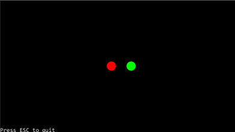
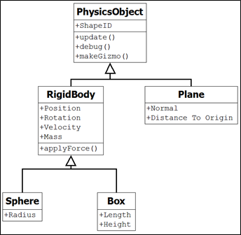
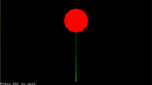
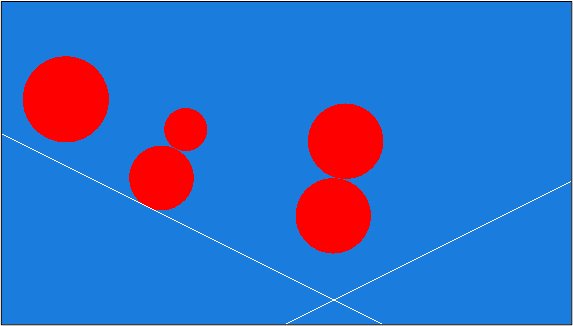
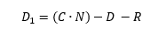
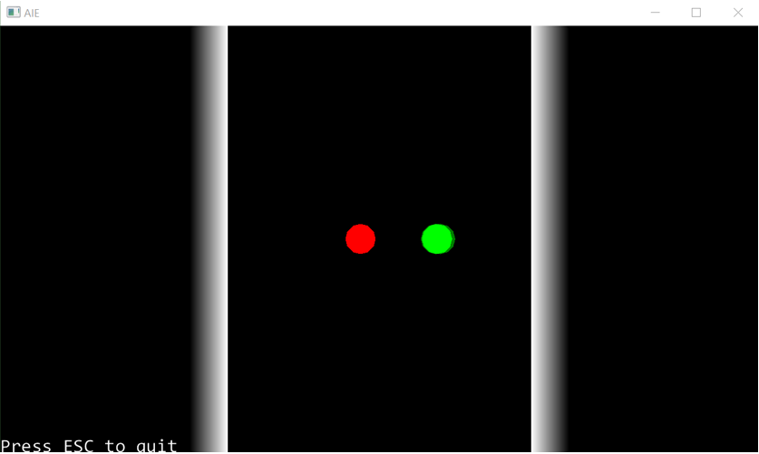
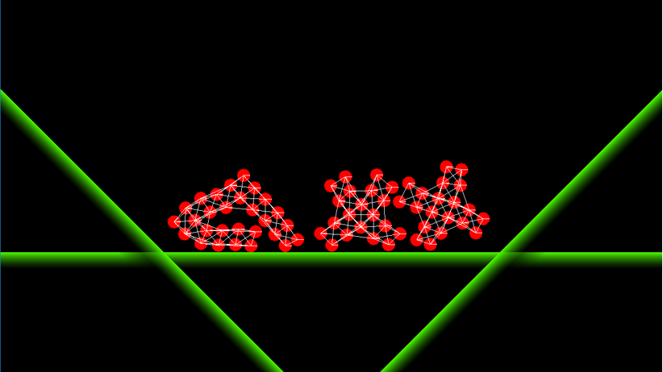

# Tutorial – Setup Bootstrap
 

## Introduction:
In this tutorial we are going to be familiarizing ourselves with the 2D drawing functionality of the AIE Bootstrap framework. Hopefully you will already be familiar with this framework, so for the most part this should be a bit of revision.

We won’t be concerning ourselves with any physics in this lecture. Instead, we will focus on drawing some 2D shapes. We’ll create a Breakout clone screen (not a game) by arranging some shapes in a 2D world. 

While our program won’t be interactive and will contain no game logic, you could extend this program throughout this course to create your own Breakout clone game.

## Downloading and Installing:
If you haven’t already done so, download the AIE Bootstrap framework from GitHub via this link:
https://github.com/AcademyOfInteractiveEntertainment/aieBootstrap/archive/master.zip 
This will directly download the framework for you to begin working with. 

Even if you already have a copy of this project, it is a good idea to download a fresh copy. This project is continually being updated, and the latest changes add support for Visual Studio 2022.

Alternatively, you may wish to set up your own Git project and clone the repository. Cloning the repository is not necessary, although it will allow you to be notified when updates and changes are made to the framework.

The landing page for this project contains some additional information, including video tutorials on how to set up a Git project: ```https://github.com/AcademyOfInteractiveEntertainment/aieBootstrap```

Once you have download the project, extract it to a folder on your machine. The project comes complete with a solution and a 2D and 3D demonstration project.

Before opening the solution, install the project templates if you have not already done so.

Locate the project templates in the aieBootstrap-master\tools\ProjectTemplates folder.

Copy the two .zip files into the Visual Studio templates directory. You’ll find this in your MyDocuments folder, for example:
	Documents\Visual Studio 2017\Templates\ProjectTemplates\Visual C++ Project\

Copy both of the .zip files to this location. Do not extract the .zip files.

After restarting Visual Studio you will now see two new project templates available whenever you create a new Visual C++ project.

## Clearing the Template Cache:
If you already have the templates installed and you wish to update them, you’ll need to clear the Visual Studio template cache.

The easiest way to do this is to use the Developer Command Prompt for Visual Studio 2022.

Before beginning, make sure Visual Studio is closed.

From the Windows Start menu, search for and open the Developer Command Prompt for VS 2022

This will launch a console window. Type the following command:
devenv /updateconfiguration

This will update the project template cache. Open Visual Studio again and you should now see both the 2D and 3D bootstrap project templates when you create a new project.

## Working with AIE Bootstrap:

The AIE Bootstrap framework comes with a provided Visual Studio solution (Bootstrap.sln). 

Open this solution in Visual Studio, or double-click on the .sln file.

The Bootstrap project is the framework itself. Every 2D or 3D project you make will link with this library to enable features like drawing using OpenGL, or handling keyboard input.

You will need to build the Bootstrap project. You can also build and execute the 2D and 3D projects if you wish to run these provided demonstration programs.

## Creating a New Project:

When working on a new tutorial, you will need to add your project to this solution.

Adding your project to this solution is much easier than creating a new solution for each tutorial and trying to import the Bootstrap library manually.

To create a new project, right-click on the solution name in the Solution Explorer and select Add -> New Project.

Select the 2D project template (since we will be creating our physics simulation in 2D).

In the Solution Explorer, right-click on your new project and select Set as StartUp Project. This means that when you press the Compile button, this is the project that will be compiled.

Finally, we need to set the execution path of the project.

Right-click on your new project and select Properties. 

Change the **Working Directory** under the **Debugging** settings to <b>```$(SolutionDir)bin\```</b>.

Then ensure the <b>Additional Library Directories</b> in <b>Linker</b> is set to <b>```$(SolutionDir)temp\Bootstrap\$(Platform)\$(Configuration)\;%(AdditionalLibraryDirectories)```</b>

And then ensure the <b>Additional Include Directories</b> in <b>C/C++</b> is set to <b>```$(SolutionDir)bootstrap;$(SolutionDir)dependencies/imgui;$(SolutionDir)dependencies/glm;%(AdditionalIncludeDirectories)```</b>

This will ensure the program can find all required libraries and resource files when it executes.

You’ve just created a new project that uses the AIEBootstrap library. 

## Retarget Your Project:
Before continuing with the rest of the tutorial, try to compile and run your project now.

If you get an error saying your project was made using a different version of the compiler, you’ll need to retarget the project. (This is because the templates have been made with a previous version of Visual Studio).

In the Solution Explorer, right-click on the project name and select Retarget Projects. Hit OK. 

Your project will then be set to use the latest SDK, and you can compile and execute as normal.


# Tutorial – Fixed Timestep
 

## Introduction and Objective:
In this tutorial, we will begin creating a custom 2D physics engine. Over the next several sessions we will build on these tutorials, adding features as we discuss new concepts during class.

This first tutorial will set up the application and a physics scene using a fixed timestep.

At the end of this tutorial you will not have a working program. But you will have a codebase you can use when working through the next tutorial, should you choose to use it. Alternatively, you may choose to ignore this tutorial and start from scratch in the tutorial for the session on Linear Force and Momentum.

 

## Required Resources:
We begin building off the AIE Bootstrap 2D project.

Bootstrap is a simple OpenGL C++ engine developed at AIE.

Grab **aieBootstrap_2023** from **Teams -> Programming Year 2 2023 -> General -> Physics for Games**

An older version of Bootstrap could be downloaded from Git here: https://github.com/AcademyOfInteractiveEntertainment/aieBootstrapLinks to an external site.

 

## Process:
Unzip it, remove the 3D project from the solution, and rename the 2D project and its Application-derived class to something suitable like “Physics” and “PhysicsApp”.

Its also a good idea to rename the Solution at this point, and then upload it into your source control of choice.

Our objective in this tutorial is setting up a *PhysicsScene* class. This class will control the simulation and drawing of all physical objects in our game.

Create a new class called *PhysicsScene* that has the following interface. 

 
``` c++
class PhysicsScene
{
public:
   PhysicsScene();
   ~PhysicsScene();

   void AddActor(PhysicsObject* actor);
   void RemoveActor(PhysicsObject* actor);
   void Update(float dt);
   void Draw();

   void SetGravity(const glm::vec2 gravity) { m_gravity = gravity; }
   glm::vec2 GetGravity() const { return m_gravity; }

   void SetTimeStep(const float timeStep) { m_timeStep = timeStep; }
   float GetTimeStep() const { return m_timeStep; }

protected:
   glm::vec2 m_gravity;
   float m_timeStep;
   std::vector<PhysicsObject*> m_actors;
};
```

You will need to include the *glm::vec2* class header, as well as the *std::vector* class header, and forward declare the *PhysicsObject* class.

This class should be relatively straightforward at this point.

We have a vector collection (m_actors) that stores all the physical objects in the scene, along with functions to add and remove objects to and from this list.

You will notice that we have two update functions. One called *Update()*, and one called *Draw()*.

The *Update()* function will update the physical simulation. It will call the update function of each actor, ensuring that the actors position is updated according to its internal state. It will also be where we handle collision detection and response.

The *Draw()* function will be called by the application once per frame. Essentially, this function will be responsible drawing the physical objects. Because we are batching our draw calls we want to add each gizmo to the render using an add function call during the update loop. Then, when drawing, the renderer can draw all objects at once.

If you explore the *Gizmos* class in the bootstrap framework, you will see functions for adding a variety of objects, like circles and lines, to the renderer. Gizmos also has a draw2D function, which draws all gizmos added during the last update.

We won’t be implementing any physical objects for the application to simulate or draw during this tutorial, but it is important to understand how the application is structured so that you can proceed with future tutorials.

Before continuing ensure you have implemented the following functions of the PhysicsScene class:

constructor: initialize the timestep (0.01f) and gravity (0,0).
*addActor()*: adds a *PhysicsObject* pointer to the end of the *m_actors* vector.
*removeActor()*: removes a *PhysicsObject* pointer from the *m_actors* vector.
We’ll discuss how to implement the *PhysicsScene::update()* and *PhysicsScene::draw()* functions later in this tutorial.

 

Before we implement the two update functions, we’ll create the definition of the *PhysicsObject* class.

``` c++
class PhysicsObject
{
protected:
    PhysicsObject() {}

public:
    virtual void FixedUpdate(glm::vec2 gravity, float timeStep) = 0;
    virtual void Draw() = 0;
    virtual void ResetPosition() {}; 
}; 
```
*PhysicsObject* is a pure abstract base class. This means that we can’t construct an instance of this class because it is too general. Classes derived from PhsyicsObject will have to provide implementtaions of fixedUpdate and draw in order to be constructable.

We won’t be deriving anything from it during this tutorial. We simply define the class so that our *PhysicScene* class implementation is complete.

In future sessions you will define shapes, like AABBs and circles, that derive from this class.

---


Return to the .cpp file for the *PhsyicsScene* class and add the following function implementations:

``` c++
PhysicsScene::PhysicsScene() : m_timeStep(0.01f), m_gravity(glm::vec2(0, 0))
{
}

void PhysicsScene::Update(float dt)
{
    // update physics at a fixed time step

    static float accumulatedTime = 0.0f;
    accumulatedTime += dt;

    while (accumulatedTime >= m_timeStep)
    {
        for (auto pActor : m_actors)
        {
            pActor->fixedUpdate(m_gravity, m_timeStep);
        }

        accumulatedTime -= m_timeStep;
    }
}

void PhysicsScene::Draw()
{
    for (auto pActor : m_actors) {
        pActor->draw();
    }
}
```
In the PhysicsScene::update() function, we’ve implemented a fixed timestep using the pseudocode outlined in the lecture slides.

Note that in future tutorials you will need to keep track of the previous and current position of each physics object so that you can interpolate between the two states when drawing. While this is not essential, failing to do this will mean that your simulation will stutter slightly – a problem known as temporal aliasing.

---


The final task is to integrate our PhysicsScene class into our application class.

Add a new PhsicsScene* variable to your application class called m_physicsScene, and update your application’s functions as follows:

``` c++
bool Physics00_FixedTimestepApp::startup() { 
    // increase the 2d line count to maximize the number of objects we can draw
    aie::Gizmos::create(255U, 255U, 65535U, 65535U);

    m_2dRenderer = new aie::Renderer2D();
    m_font = new aie::Font("./font/consolas.ttf", 32);

    m_physicsScene = new PhysicsScene();
    m_physicsScene->SetTimeStep(0.01f);
    return true;
}

void Physics00_FixedTimestepApp::update(float deltaTime) {
    // input example
    aie::Input* input = aie::Input::getInstance();

    aie::Gizmos::clear();

    m_physicsScene->Update(deltaTime);
    m_physicsScene->Draw();

    // exit the application
    if (input->isKeyDown(aie::INPUT_KEY_ESCAPE))
        quit();
}

void Physics00_FixedTimestepApp::draw() {
    // wipe the screen to the background colour
    clearScreen();

    // begin drawing sprites
    m_2dRenderer->begin();

    // draw your stuff here!
    static float aspectRatio = 16 / 9.f;
    aie::Gizmos::draw2D(glm::ortho<float>(-100, 100, -100 / aspectRatio, 100 / aspectRatio, -1.0f, 1.0f));

    // output some text, uses the last used colour
    m_2dRenderer->drawText(m_font, "Press ESC to quit", 0, 0);
    // done drawing sprites
    m_2dRenderer->end();
}
``` 

If you can’t find the header file that includes the *glm::ortho* function, it’s in <glm\ext.hpp>.

 

After creating the *PhysicsScene* object, we set the timestep to 0.01. Decreasing the value of this timestep will increase the accuracy of our physic simulation at the expense of increased processing time. Setting this value too high will make out simulation stutter, in addition to reducing the stability of the simulation.

The *update()* function will call each update function of the PhysicsScene class in turn. And the *Draw()* function will simply call *Gizmos::draw2D()* to draw any gizmos added to the renderer during the last update (gizmos are cleared every frame via the call to Gizmos::clear() in the update() function).

 

Compile your work. You should be able to compile without errors (ensure you added the implementation of the addActor and removeActor functions in the *PhysicsScene* class yourself).


## Activity 1: Research and implement addActor() and removeActor()

Consult the C++ *std::list* documentation online to work out how to implement *AddActor()* and *RemoveActor()*. Now *AddActor()* is fairly striaghtforwards. For *RemoveActor()* you’ll want to use **erase**, which takes an iterator rather than an object. You’ll first need to use another function to return an iterator for a given value, and make sure you consider the case where your client code asks to remove an actor that isn’t present in the scene. Look up the documentation for *std::find* and make a note of which file you’ll need to include to use it.

Even if you execute your program, at this state all you will see is a blank screen. However, our application is now set up to begin the next tutorial.

 

As you complete future tutorials, you may wish to modify them to allow the renderer to interpolate between the current and past positions of your physics objects so as to adjust for any temporal aliasing.

 

## Next Tutorial:
Linear Force and Momentum in the Linear Force and Momentum section


# Tutorial – Linear Force and Momentum
## Introduction and Objective:
In this tutorial we will add a Circle class to our simulation, which extends the PhysicsObject abstract class we implemented in the previous tutorial.

We will also implement some basic movement, collision detection, and collision response, so that we can give our Circles some initial velocity and watch them collide.



## Prerequisites:
You will need to have completed the following tutorials:

***Fixed Timestep Tutorial – available under the Introduction to Physics session.***
 

## Physics Objects:
For our purposes, you can assume that each physics object (or actor) in the scene has a single collision volume and that there are initially only three types:

- Plane
- Circle
- Box


The actors in a physics engine can be static or dynamic.  Static objects do not move so only need position and orientation (remember this is 2D so we need a vec2 for position and single float for the orientation angle).  The Plane can only be static (it makes no sense for something with infinite extents and infinite thickness to move about in our scene)

 

Dynamic actors have some additional properties:

- Mass
- Velocity


The following [UML Class Diagram](https://aie.instructure.com/courses/808/pages/Code%20Design%20and%20Data%20Structures%20-%20UML?titleize=0 "To learn more about what UML Diagrams are, please look back at the optional learning of Year 1") illustrates the complete actor class hierarchy that we will implement in our physics engine:



Note how everything is derived from a single base class, the *PhysicsObject* class we implemented in the previous tutorial. This design choice was made so that we can iterate through a single list when updating and adding gizmos to our scene. This will also allow us to write our collision detection routines in a neater form later on. 

In this tutorial we’ve updated the *PhysicsObject* class to include a single variable: ShapeID.  This is used for collision detection in a later tutorial.  The code will be neater if you use an enumerated type for this.

Your updated definition for the *PhysicsObject* class is as follows:

```c++
enum ShapeType {
    PLANE = 0,
    Circle,
    BOX
};

class PhysicsObject {
protected:
    PhysicsObject(ShapeType a_shapeID) : m_shapeID(a_shapeID) {}

public:
    virtual void FixedUpdate(glm::vec2 gravity, float timeStep) = 0;
    virtual void Draw() = 0;
    virtual void ResetPosition() {};

protected:
    ShapeType m_shapeID;
};
```

You will need a ‘getter’ to return the m_shapeID.

In this tutorial we will only create the *RigidBody* and *Circle* sub-classes. You may wish to start defining the Box and Plane class yourself now, although we will cover these in a future tutorial.

## The RigidBody Class:
All dynamic actors will inherit from the *RigidBody* class. Because this class will serve as a base class for any kind of dynamic actor (Circle, Box, or any other shape that may be added in the future), it will encapsulate the variables relating to movement and position.

Create the new *RigidBody* class and update the class definition as follows:

```c++
class Rigidbody : public PhysicsObject {
public:
    Rigidbody(ShapeType shapeID, glm::vec2 position, 
            glm::vec2 velocity, float orientation, float mass);
    ~Rigidbody();

    virtual void FixedUpdate(glm::vec2 gravity, float timeStep);
    void ApplyForce(glm::vec2 force);
    void ApplyForceToActor(Rigidbody* actor2, glm::vec2 force);

    glm::vec2 GetPosition() { return m_position; }
    float GetOrientatation() { return m_orientation; }
    glm::vec2 getVelocity() { return m_velocity; }
    float GetMass() { return m_mass; }

protected:
    glm::vec2 m_position;
    glm::vec2 m_velocity;
    float m_mass;
    float m_orientation;    //2D so we only need a single float to represent our orientation
};
```

Start by implementing the constructors, which should initialize the member variables.

The *ApplyForce()* function is where we apply Newton’s second law. This function will modify the velocity of the object according to the object’s mass and how much force has been applied.

Applying a force to an object will either speed it up or slow it down. That is to say, applying a force will change the acceleration of an object. By adding the acceleration to the current velocity, we find the object’s new velocity.

As you would recall from the lecture, according to Newton’s Second Law acceleration is calculated by dividing force by mass (a = F/m). So, in the *ApplyForce()* function you will need to calculate acceleration and add it to the m_velocity member variable. You should be able to write this as one line of code.

The *ApplyForceToActor()* function prototype is a variation of the *ApplyForce()* function.  It allows us to simulate one actor “pushing” another.

You may recall Newton’s third law, which states “for every action, there is an equal and opposite reaction”. In the *ApplyForceToActor()* function you must first apply the input force to the input actor (by calling the *ApplyForce()* function of that actor), and then apply the opposite force to the current actor (by calling *ApplyForce()* on this using the negative force).

Finally, the *FixedUpdate()* function will apply any forces to the actor (i.e., gravity) before calculating the final position.

In this engine we’re passing the gravity as an argument each time we call the Rigidbody’s *FixedUpdate()* function. The gravity can be set when the application launces, and will be either zero (for a top-down pool table simulation) or non-zero (for an Angry Birds style game). Apply it as a force, but multiply by the object’s mass first so that it acts as a pure acceleration. We’ll divide by mass again inside our *ApplyForce()* function as per Newton’s Second Law.

After applying gravity as a force, we add the updated vector to the actor’s position to get the new position of the actor.

```c++
void Rigidbody::FixedUpdate(glm::vec2 gravity, float timeStep)
{
    m_position += m_velocity * timeStep;
    ApplyForce(gravity * m_mass * timeStep);
}
```

Whether we apply the force of gravity before or after updating the position, we introduce a systematic error into our physics simulation. For now its preferable to apply gravity afterwards. We’ll return to this point later when we have enough features to test it properly.
 

## The Circle Class:
The definition for the Circle class is as follows:

``` c++
class Circle : public Rigidbody
{
public:
    Circle(glm::vec2 position, glm::vec2 velocity, 
        float mass, float radius, glm::vec4 colour);
    ~Circle();

    virtual void Draw();

    float GetRadius() { return m_radius; }
    glm::vec4 GetColor() { return m_color; }

protected:
    float m_radius;
    glm::vec4 m_color;
};
``` 

We have a single constructor which allows us to instantiate an actor in our scene with a starting position, velocity, mass radius and color. Make sure you call the base class (Rigidbody) constructor, passing in the appropriate shape type. This is the constructor definition for the *Circle* class, other shape classes will be similar:

```c++
Circle::Circle(glm::vec2 position, glm::vec2 velocity, float mass, float radius, glm::vec4 color) : 
    Rigidbody(Circle, position, velocity, 0, mass)
{
    m_radius = radius;
    m_color = color;
}
```
In the definition of the class, note how we have not added the *FixedUpdate(), ApplyForce()* or *ApplyForceToActor()* functions. These are implemented in the rigid body class, and as they will always be the same for all sub-classes, we won’t need to overload them here. However, because all our shape sub-classes require a different type of gizmo to represent them visually, it makes sense to provide them with unique Draw() functions.

The draw function will simply call the *add2DCircle()* function of the Gizmo class, passing in the appropriate arguments. This is a static function, and don’t forget that the Gizmo class is defined within the aie namespace.

For now, you don’t need to derive classes for the plane or the boxes.  All our experiments with Newton’s laws of motion and the projectile physics will be done with Circles.

## The PhysicsScene Class:
We want to update our PhysicsScene class to check for collisions between all the Circles in our simulation.

Ideally, we’d want to implement some sort of spatial partitioning system to help optimize the number of collision checks we need to perform. However, for our purposes, a simple nested for loop will suffice (although you definitely wouldn’t want to use this in any sort of real application).

Add the following code to your PhysicsScene::update() function:

```c++
void PhysicsScene::Update(float dt) {

    // update physics at a fixed time step
    static float accumulatedTime = 0.0f;
    accumulatedTime += dt;

    while (accumulatedTime >= m_timeStep) {
        for (auto pActor : m_actors) {
            pActor->FixedUpdate(m_gravity, m_timeStep);
        }
        accumulatedTime -= m_timeStep;

        // check for collisions (ideally you'd want to have some sort of 
        // scene management in place)
        int actorCount = m_actors.size();

        // need to check for collisions against all objects except this one.
        for (int outer = 0; outer < actorCount - 1; outer++)
        {
            for (int inner = outer + 1; inner < actorCount; inner++)
            {
                PhysicsObject* object1 = m_actors[outer];
                PhysicsObject* object2 = m_actors[inner];
                
                // for now we can assume both shapes are Circles, 
                // since that is all we’ve implemented for now.
                Circle2Circle(object1, object2);
            }
        }
    }
}
```
Note how the second for loop starts at outer+1 rather than 0. We only want to compare each pair of objects once rather than twice, and we don’t want to compare each object against itself

The Circle2Circle function is a static function of PhysicsScene. We’ll be adding more of these in later tutorials to cover the different code we need for checking collisions between different types of primitives.

```c++
static bool Circle2Circle(PhysicsObject*, PhysicsObject*);
```

In the function implementation, we cast both PhysicsObjects to Circles and determine whether they’ve collided or not by examining their positions and radii.

We’ll implement physically realistic collision response later, where the balls bounce off each other based on velocity and mass. For now, we can just set both velocities to zero.

We need to test the collision detection routine, and this will be an unambiguous visual indiciation when both balls stop completely when they touch.

```c++
bool PhysicsScene::Circle2Circle(PhysicsObject* obj1, PhysicsObject* obj2)
{
    // try to cast objects to Circle and Circle
    Circle* sphere1 = dynamic_cast<Circle*>(obj1);
    Circle* sphere2 = dynamic_cast<Circle*>(obj2);
    // if we are successful then test for collision
    if (sphere1 != nullptr && sphere2 != nullptr)
    {
        // TODO do the necessary maths in here
        // TODO if the Circles touch, set their velocities to zero for now
    }
}
```
You can calculate the distance between the two centres manually, or use the helper function *glm::distance* and pass the Circle centers in.

Compare this distance to the sum of the radii to determine whether a collision has taken place.

As a final bit of housekeeping, now that we’ll be adding actors to our m_actors vector, we’ll want to ensure that we’re deallocating our memory correctly when cleaning up our scene. Ensure you are deleting any objects in the scene in the scene destructor like so.

``` c++
PhysicsScene::~PhysicsScene()
{
    for (auto pActor : m_actors)
    {
        delete pActor;
    }
}
```

## Activity 1: Demonstrating Newton’s First Law
We’ll start by demonstrating Newton’s first law – ***an object in motion will remain in motion until acted upon by an external force***.

To do this we’ll turn off gravity, add a single Circle to our scene, and give our Circle an initial velocity. The Circle should remain travelling at a constant speed in a fixed direction.

Update the startup() function of your application class as follows:

``` c++
bool PhysicsApp::startup() {
    // increase the 2d line count to maximize the number of objects we can draw
    aie::Gizmos::create(255U, 255U, 65535U, 65535U);

    m_2dRenderer = new aie::Renderer2D();

    m_font = new aie::Font("./font/consolas.ttf", 32);

    // initialize the physics scene
    m_physicsScene = new PhysicsScene();
    m_physicsScene->SetGravity(vec2(0, 0));
    m_physicsScene->SetTimeStep(0.01f);

    Circle* ball;
    ball = new Circle(vec2(-40, 0), vec2(10, 30), 3.0f, 1, vec4(1, 0, 0, 1));
    m_physicsScene->AddActor(ball);
    return true;
}
```

Compile and execute your program to see Newton’s first law at work.

## Activity 2: Demonstrating Newton’s Second Law

Newton’s second law – ***When a body is acted upon by a force, the time rate of change of its momentum equals the force.***.

To simulate Newton’s second law, simply set the gravity to a non-zero value, for example (0,-10).  In this case the actor should move in a parabolic path simulating the movement of a projectile.  Applying a force to the actor whilst the simulation is running further demonstrates the second law.

## Activity 3: Demonstrating Newton’s Third Law:

Finally, Newton’s third law – ***If two bodies exert forces on each other, these forces have the same magnitude but opposite directions.***.

Newton’s third law is trickier to demonstrate. For this, we will use the Rigidbody::ApplyForceToActor() function. 

To demonstrate Newton’s third law, instantiate two Circles of the same mass and radius next to each other in the centre of the screen. 

In the application’s update() function scan for a key press. When the key is pressed use the ApplyForceToActor() to apply a force, once, to one of the actors. Alternatively, call the ApplyForceToActor() function at the end of the startup() function, leaving the update() function unmodified.

The force you apply must be towards the second actor.  You should find that the two actors move away from each other with equal velocities.

Repeat the experiment but try it with Circles of different masses.

```c++
    m_physicsScene->SetGravity(vec2(0, 0));  // turn off gravity

    Circle* ball1 = new Circle(vec2(-4, 0), vec2(0, 0), 4.0f, 4, vec4(1, 0, 0, 1));
    Circle* ball2 = new Circle(vec2(4, 0), vec2(0, 0), 4.0f, 4, vec4(0, 1, 0, 1));

    m_physicsScene->AddActor(ball1);
    m_physicsScene->AddActor(ball2);

    ball1->ApplyForceToActor(ball2, vec2(-2, 0));
```

## Activity 4: Simulating a Collision:
For this simulation, create two Circles some distance apart on the screen. Give each Circle an initial velocity such that it moves towards the other Circle. After some time the Circles will collide (the collision will be detected by the placeholder collision, and both balls should stop completely when they touch).

```c++
    // turn off gravity
    m_physicsScene->SetGravity(vec2(0, 0));

    Circle* ball1 = new Circle(vec2(-20, 0), vec2(0), 4.0f, 4, vec4(1, 0, 0, 1));
    Circle* ball2 = new Circle(vec2(10, 0), vec2(0), 4.0f, 4, vec4(0, 1, 0, 1));

    m_physicsScene->AddActor(ball1);
    m_physicsScene->AddActor(ball2);

    ball1->ApplyForce(vec2(30, 0));
    ball2->ApplyForce(vec2(-15, 0));
```

## Activity 5:  Simulating a Rocket Motor:
Finally, you can simulate a simple rocket motor. Create a Circle in the centre of the screen, this is the rocket. Set gravity to zero. In the update function, at time intervals, you need to:

- Reduce the mass of the rocket by M to simulate fuel being used
- Create a new Circle of mass M next to the rocket to simulate an exhaust gas particle (ensuring that the two Circles won’t collide – in fact, this simulation will work better if you turn off collision detection altogether)
- Use ApplyForceToActor() to apply force to the exhaust gas from the rocket (make sure it is in the correct direction)
Repeat until all the mass has been used up
- You will need to experiment with different forces and masses, firing rate, to make it work properly. 

For added effect make the exhaust gas particles smaller than the rocket and a different colour.  

### Extension
- Try turning gravity on and see if you can get the rocket to lift off against gravity. 
- Try changing the direction of the force you apply to steer the rocket around the screen.



## Next Tutorial:
Collision Detection in Collision Detection section


# Tutorial – Collision Detection


 

## Introduction and Objective:
In this tutorial we introduce simple collision detection in our engine. We will start with Circle-to-Circle collision detection, then add Circle-to-Plane. Finally, we will add boxes and add collision detection for those using the separate axis theorem.

We won't add collision response at this stage, our objects will simply stop after a collision.
 

## Prerequisites:
We are going to be using the DIY Physics engine that you have been writing.

Ensure you have completed the following tutorials:
- ***Fixed Timestep Tutorial. Available in the Introduction to Physics session.***
- ***Linear Force and Momentum Tutorial. Available in the Linear Force and Momentum session.***

Although recommended, it is not necessary to have completed the following previous tutorials:
- ***Projectile Physics part 1: Analytical Solution. Available in the Projectile Physics session.***
- ***Projectile Physics part 2: Numerical Integration. Available in the Projectile Physics session.***
 

## Adding a Plane Class:
If you have not already done so you need derive a plane object and provide a way to add it to your scene. A plane different from a normal rigid body as it has infinite extents and it usually makes no sense for it to be dynamic. It's a good object to have in our physics engine though because it's relatively easy to work with.

The best way to represent it is as a surface normal and a minimum distance from the plane to the origin. These two pieces of information (the surface normal and distance from the origin) fix the plane’s position in space.  Because our plane is 2D we use a glm::vec2 for the normal.

The plane is one-sided, and considered to extend to infinity along both it’s edge and backwards from its normal direction. This is simpler to write than a two-sided plane, and also less susceptible to numerical instability issues.

The following is a suitable class definition for the plane: 

``` c++
class Plane : public PhysicsObject
{
public:
    Plane(glm::vec2 normal, float distance);
    ~Plane();

    virtual void FixedUpdate(glm::vec2 gravity, float timeStep);
    virtual void Draw();
    virtual void ResetPosition();

    glm::vec2 GetNormal() { return m_normal; }
    float GetDistance() { return m_distanceToOrigin; }

protected:
    glm::vec2 m_normal;
    float m_distanceToOrigin;
};
```

The implementation of all of these functions, excepting the Draw() function, are all relatively trivial. Because all plane objects will be static, the FixedUpdate() function will be empty. The other functions will simply set various member variables. You should be able to complete these by yourself.

Of course, the draw() function must add a suitable gizmo to represent the plane. Because planes are infinite in size this is slightly tricky to do. The following function is a simple way of generating to represent the plane in 2D. If you zoom the camera out a long way you may need to increase the length of the line.

The colourFade colour in the code below is a zero-alpha copy of the colour used to draw the plane.

This gives the plane a solid edge that fades away to nothing behind it.

``` c++
void Plane::Draw()
{
    float lineSegmentLength = 300;
    glm::vec2 centerPoint = m_normal * m_distanceToOrigin;
        // easy to rotate normal through 90 degrees around z
    glm::vec2 parallel(m_normal.y, -m_normal.x);
    glm::vec4 colourFade = m_colour;
    colourFade.a = 0;
    glm::vec2 start = centerPoint + (parallel * lineSegmentLength);
    glm::vec2 end = centerPoint - (parallel * lineSegmentLength);
    //aie::Gizmos::add2DLine(start, end, colour);
    aie::Gizmos::add2DTri(start, end, start - m_normal*10.0f, m_colour, m_colour, colourFade);
    aie::Gizmos::add2DTri(end, end - m_normal * 10.0f, start - m_normal * 10.0f, m_colour, colourFade, colourFade);
}
```

Now that we have moving circles and a plane we can start thinking about our collision routine. In later lectures we optimize the process but for now we'll use a brute force approach and test collision between every pair of objects.

 

## Calling the Correct Collision Detection Routine:
We need a way to pick the correct collision detection routine based on the pair of objects which are colliding. When two circles collide then we need to call the Circle2Circle collision routine, but if a Circle strikes a plane we need Circle2Plane.

Before we can pick the correct routine we need a way to identify what types of objects are involved in the collision.

C++ provides methods for us to determine the type of a derived class at run time (like dynamic casting) but these are slow. What would be preferable is an integral type identifier (like an enum).

This is where the shapeID variable we added earlier comes in.  We will use it to identify what type of object is colliding. The advantage of using an enumerated type over a series of hard-coded integers is that it will make our code easier to read.

When we call the base class constructor in our derived shape classes, we'll pass in the shapeID for the appropriate object.

You should have already done this when implementing your Circle class. Here it is again for the default constructor of the Plane class:
``` c++
Plane::Plane() : PhysicsObject(ShapeType::PLANE) {
    m_distanceToOrigin = 0;
    m_normal = glm::vec2(0, 1);
}
```
Now, when we check for collisions between pairs of objects, we can use their shapeID to pick the appropriate collision detection routine. 

One way to implement this is by using a nested switch statement. But this rapidly becomes unwieldy to code and difficult to maintain.  The following code illustrates how quickly this happens even with just circles and planes (you don’t need this code, it’s just here to illustrate a point!):

(**Note: don’t put this code in your program, we’re illustrating the wrong way to implement this**)

```
// DO NOT USE THE FOLLOWING
void PhysicScene::checkForCollisionUsingSwitch() {
    int actorCount = m_actors.size();
    //need to check for collisions against all objects except this one.
    for (int outer = 0; outer < actorCount - 1; outer++) {
        for (int inner = outer + 1; inner < actorCount; inner++) {
            PhysicsObject* object1 = m_actors[outer];
            PhysicsObject* object2 = m_actors[inner];
            ShapeType shapeID1 = object1->m_shapeID;
            ShapeType shapeID2 = object2->m_shapeID;
            switch (shapeID1) {
                case PLANE:
                       switch (shapeID2) {
                        case PLANE:
                            Plane2Plane(object1, object2);
                            break;
                        case CIRCLE:
                            Plane2Circle(object1, object2);
                            break;
                    }
                    break;
                case CIRCLE:
                    switch (shapeID2) {
                        case PLANE:
                            Plane2Plane(object1, object2);
                            break;
                        case CIRCLE:
                            Plane2Circle(object2, object1);
                            break;
                    }
                    break;
            }
        }
    }
}
// DO NOT USE THE FOLLOWING
```

A much neater solution is to use an array of function pointers. 

We then combine the shapeID of actor1 and the shapeID of actor2 to form an index into the array. This provides a function pointer for the function we need to perform the correct type of collision.   We call the function and pass pointers two actors into it.

The following code shows the complete collision detection function using an array of function pointers. Replace the hardcoded call to Circle2Circle we had inside PhysicScene::update with this function pointer based approach.

``` c++
// function pointer array for doing our collisions
typedef bool(*fn)(PhysicsObject*, PhysicsObject*);

static fn collisionFunctionArray[] =
{
    PhysicsScene::Plane2Plane, PhysicsScene::Plane2Circle,
    PhysicsScene::Circle2Plane, PhysicsScene::Circle2Circle, 
};

void PhysicsScene::Update(float dt)
{
...
    int actorCount = m_actors.size();

    //need to check for collisions against all objects except this one.
    for (int outer = 0; outer < actorCount - 1; outer++)
    {
        for (int inner = outer + 1; inner < actorCount; inner++)
        {
            PhysicsObject* object1 = m_actors[outer];
            PhysicsObject* object2 = m_actors[inner];
            int shapeId1 = object1->GetShapeID();
            int shapeId2 = object2->GetShapeID();

            // using function pointers
            int functionIdx = (shapeId1 * SHAPE_COUNT) + shapeId2;
            fn collisionFunctionPtr = collisionFunctionArray[functionIdx];
            if (collisionFunctionPtr != nullptr)
            {
                // did a collision occur?
                collisionFunctionPtr(object1, object2);        
            }
        }
    }
}
```

*SHAPE_COUNT* is a constant defined as the number of primitive shapes our physics engine handles (i.e., the number of enumerated values in the ShapeType enum). If we make it the last item in the shapes enumerated type then it will always be set up correctly. 

Be careful that *SHAPE_COUNT* is correct. If you have a 2x2 array of functions pointers, *SHAPE_COUNT* will need to be 2 for this to work. If you’ve already declared BOX in your ShapeType enum, it may be 3, which will cause a number of collisions to not work correctly. If this is the case, comment out the enum definition for BOX for now so that *SHAPE_COUNT* is 2.

The updated header file for the *PhysicsScene* class looks like this:

``` c++
class PhysicsScene
{
public:
    PhysicsScene();
    ~PhysicsScene();

    void AddActor(PhysicsObject* actor);
    void RemoveActor(PhysicsObject* actor);
    void Update(float dt);
    void Draw();
    void debugScene();

    void SetGravity(const glm::vec2 gravity) { m_gravity = gravity; }
    glm::vec2 GetGravity() const { return m_gravity; }

    void SetTimeStep(const float timeStep) { m_timeStep = timeStep; }
    float GetTimeStep() const { return m_timeStep; }
    
    void CheckForCollision();

    static bool Plane2Plane(PhysicsObject*, PhysicsObject*);
    static bool Plane2Circle(PhysicsObject*, PhysicsObject*);
    static bool Circle2Plane(PhysicsObject*, PhysicsObject*);
    static bool Circle2Circle(PhysicsObject*, PhysicsObject*);

protected:
    glm::vec2 m_gravity;
    float m_timeStep;
    std::vector<PhysicsObject*> m_actors;
};
```

The code is already neater than the equivalent using switch statements (probably faster to execute too) but the big advantage comes when we add another primitive. 

For example, if we want to add support for boxes in our engine we simply add the enumerated type, provide the correct functions and add the function pointers to the array as follows:

``` c++
static fn collisionFunctionArray[] =
{
   PhysicsScene::Plane2Plane,  PhysicsScene::Plane2Circle,  PhysicsScene::plane2Box,
   PhysicsScene::Circle2Plane, PhysicsScene::Circle2Circle, PhysicsScene::sphere2Box,
   PhysicsScene::box2Plane,    PhysicsScene::box2Sphere,    PhysicsScene::box2Box,
};
```

As we add more shapes and the number of collision permutations increases, so the advantage of this approach becomes much greater. 

Note how we want to use the same function for handling Circle to plane and plane to Circle but we need separate function pointers for both in the array.  The easiest way to implement this is to have separate functions for both Plane2Circle and Circle2Plane but the second function just reverses the order of the arguments and then calls the first.  

``` c++
bool PhysicsScene::Plane2Circle(PhysicsObject* obj1, PhysicsObject* obj2)
{
    // reverse the order of arguments, as obj1 is the plane and obj2 is the Circle
    return Circle2Plane(obj2, obj1);
}
```

Of course we still need to implement the functions to handle the actual collisions.  We’ll look at these next.

## Circle-To-Circle Collision:
We’ve already implemented this in the previous tutorial.

## Plane-To-Plane Collision:
We can just return false, as both planes are static and require no collision response

## Circle-To-Plane Collision:
The Circle-to-Plane and Plane-to-Circle collision detection functions look similar to the Circle-to-Circle function, except the objects we are casting to are obviously different.  The actual detection routine is a bit trickier to implement, but we’ve discussed the solution in detail during the lecture.

The trick is to note that if we find the dot product of the plane’s normal and the sphere’s position we get the distance from the Circle to the origin projected along the planes normal. If we subtract the distance of the plane to the origin (which is stored in the class) then we have the distance of the circles centre to the plane.  By subtracting the sphere’s radius from this distance, we get the distance between the sphere’s surface and the plane.

The actual formula to determine the distance between the surface of the Circle and the plane is given by:




### Where:

- *D1* is the distance of the Circle surface to the plane surface
- *C* is the centre of the Circle
- *N* is the normal to the plane
- *D* is the distance of the plane from the origin
- *R* is the radius of the Circle
If the value for *D1* is negative, it means that the *Circle* has collided with the plane.

We also want to check that the *Circle* is travelling into the plane. If it’s ravelling out already (eg the frame after a bounce) then we don’t want to perform any further collision response.

``` c++
bool PhysicsScene::Circle2Plane(PhysicsObject* obj1, PhysicsObject* obj2)
{
    Circle* Circle = dynamic_cast<Circle*>(obj1);
    Plane* plane = dynamic_cast<Plane*>(obj2);
    //if we are successful then test for collision
    if (Circle != nullptr && plane != nullptr)
    {
        glm::vec2 collisionNormal = plane->GetNormal();
        float sphereToPlane = glm::dot(Circle->GetPosition(), plane->GetNormal()) - plane->GetDistance();

        float intersection = Circle->GetRadius() - sphereToPlane;
        float velocityOutOfPlane = glm::dot(Circle->GetVelocity(), plane->GetNormal());
        if (intersection > 0 && velocityOutOfPlane < 0)
        {
            //set Circle velocity to zero here
            Circle->ApplyForce(-Circle->GetVelocity() * Circle->GetMass());
            return true;
        }
    }
    return false;
}
```

If you have implemented everything correctly you should now be able to spawn a collection of different sized circles and planes of various attitudes, give the circles velocity and check that collision is detected correctly.  In the next tutorial we’ll add physically realistic collision responses.

## Activity 1: Testing the Circle-To-Plane Collision
Set up your scene in *PhysicsApp.cpp* to drop a ball on to the plane under gravity. When the ball hits the plane, it should stop.

A horizontal plane facing upwards will have a normal of (0,1).

It’s distance from the origin should be negative, eg setting it to -30 means the plane sits on the y=-30 line.

This code will drop two balls on to a horizontal floor.

``` c++
    m_physicsScene->SetGravity(glm::vec2(0, -9.82f));

    Circle* ball1 = new Circle(glm::vec2(-20, 0), glm::vec2(0), 4.0f, 4, glm::vec4(1, 0, 0, 1));
    Circle* ball2 = new Circle(glm::vec2(10, 0), glm::vec2(0), 4.0f, 4, glm::vec4(0, 1, 0, 1));
    Plane* plane = new Plane(glm::vec2(0, 1), -30);

    m_physicsScene->AddActor(ball1);
    m_physicsScene->AddActor(ball2);
    m_physicsScene->AddActor(plane);
```

Run it and you should see the balls fall under gravity and then stop when they hit the plane.

Systematic errors in the physics simulation
The balls sit on the plane as if it’s completely solid.

Go to Rigidbody::fixedUpdate and reverse the order of the lines where you apply gravity and move the object, so that it looks like this:

``` c++
void Rigidbody::FixedUpdate(glm::vec2 gravity, float timeStep)
{
    ApplyForce(gravity * m_mass * timeStep);
    m_position += m_velocity * timeStep;
}
```

Watch closely, and you’ll see the balls sink slowly into the plane.

A little though can explain why this happens.

The collision code between calls to fixedUpdate is zero-ing the ball’s velocities. If we apply gravity first, the ball’s velocity when it gets applied to its position is one frame’s worth of acceleration due to gravity. It doesn’t accumulate velocity like it does when free-falling, because its velocity gets zero’d again every frame, but it will move down a small amount each frame.

For this reason it’s best to apply gravity after updating the position – it prevents objects that rest on each other from “quicksanding”like this.

We’ll revisit these systematic errors and their other implications when we have a physically correct collision response working.

## Next Tutorial:
Collision Resolution - Introduction in Collision Response and Friction section


# Tutorial – Collision Resolution: Introduction

## Introduction and Objective:
In this tutorial we’re going to write a generic function to resolve collisions.

The math to do this is explained in the lecture slides for this session. We’ll implement this approach in code now, and in future lessons we’ll integrate this function into our existing application so that objects that collide can respond appropriately to those collisions.

## Prerequisites:
We will be using the DIY Physics engine that you have been writing.
Ensure you have completed the following tutorials:
- ***Fixed Timestep Tutorial. Available in the Introduction to Physics session.***
- ***Linear Force and Momentum Tutorial. Available in the Linear Force and Momentum session.***
- ***Collision Detection Tutorial. Available in the Collision Detection session.***
Although recommended, it is not necessary to have completed the following previous tutorials:
- ***Projectile Physics part 1: Analytical Solution. Available in the Projectile Physics session.***
- ***Projectile Physics part 2: Numerical Integration. Available in the Projectile Physics session.***

## Resolving a Collision:
The math explaining the formulas involved in collision resolution is explained in the lecture slides, but for our purposes we only need the final formula listed at the end of the lecture:


This formula calculates the impulse magnitude (j). In other words, j is the magnitude of the force vector that needs to be applied to our colliding objects.

To put this into practice, we multiply j by n (the collision normal) to determine the force to apply to each rigidbody. For one of these collision objects we’ll apply the positive force, and for the other we apply the negative force. 

When this force is applied to the collision object via the Rigidbody class’s applyForce() function, the force will be divided by the object’s mass to calculate the correct final velocity.

---

Define a new function for your Rigidbody class as follows:

``` c++
void ResolveCollision(Rigidbody* actor2);
```

This function only accepts another rigidbody as an argument. This means that our collision response algorithm will be fairly simple, at least for now. 

We aren’t, for example, taking into consideration the contact point. We also won’t account for any angular velocity of the two objects, or the effective mass. This will simplify our algorithm at the expense of physical realism. In later tutorials we’ll look at how we can improve the accuracy and realism of this function.

The implementation of this function is as follows:

``` c++
void Rigidbody::ResolveCollision(Rigidbody* actor2)
{
	glm::vec2 normal = glm::normalize(actor2->GetPosition() - m_position);
	glm::vec2 relativeVelocity = actor2->GetVelocity() - m_velocity;

	// if the objects are already moving apart, we don't need to do anything
	if (glm::dot(normal, relativeVelocity) >= 0)
		return;

	float elasticity = 1;
	float j = glm::dot(-(1 + elasticity) * (relativeVelocity), normal) / ((1/GetMass()) + (1/actor2->GetMass()));

	glm::vec2 force = normal * j;

    ApplyForceToActor(actor2, -force);
}
```

We start off by calculating the collision normal. In the image below, the collision normal is indicated by n. It is the normal of the plane along which the collision occurs (the dotted line).
 


In many physics engines this is usually returned by the collision detection function. Choosing a collision normal can be tricky. For the moment, just using circles, it will be sufficient to use the normalized difference in position (posB - posA). This is, in fact, what has been used in the image above.

After calculating the collision normal, we need the relative velocity between the two objects. To improve our physics engine we would want to determine the total velocity of both objects, which includes both linear and rotational velocity.

We then go ahead and calculate j as per our formula. Note that we are using a coefficient of elasticity (e) of 1. This means that no energy will be lost during the collision. 

If you wanted to model different physical materials, you could define values for each object and combine them to determine a coefficient of elasticity to use in your collision response algorithm, mimicking the way game engines like Unity3D work.

The line of code that calculates j (the impulse magnitude) is a bit long, but simply reflects the formula presented earlier. 

After calculating j, we multiply it by the collision normal (n). This gives us the force to apply to each object. This is done by calling the ApplyForceToActor() function we’ve previously written. (If you don’t have this function an explanation, if not the code, is given in the tutorial for Linear Force and Momentum.)

The ApplyForceToActor() function applies the negative force to this actor, and the positive force to actor2 (thus implementing the “equal and opposite” part of Newton’s third law).

We now have a collision resolution function that we can use to modify the velocities of the objects involved in a collision.
In the next tutorial we’ll cover how we can integrate this function into our exiting collision detection code, bringing the two systems together.

For now, explore the references and any web resources you find that explain similar approaches to collision resolution. Are there any improvements you can make to the function we just wrote?

## Next Tutorial:
Collision Resolution – Circle to Circle in Collision Response and Friction section

# Tutorial – Collision Response: Circle to Circle

## Introduction and Objective:
In this tutorial, we’ll combine the collision resolution function we wrote in the previous tutorial with our existing collision detection code so that we can simulate two circles colliding and bouncing off each other.

# Prerequisites:
We will be using the DIY Physics engine that you have been writing.
Ensure you have completed the following tutorials:
- ***Fixed Timestep Tutorial. Available in the Introduction to Physics session.***
- ***Linear Force and Momentum Tutorial. Available in the Linear Force and Momentum session.***
- ***Collision Detection Tutorial. Available in the Collision Detection session.***
- ***Collision Resolution: Introduction Tutorial. Available in the Collision Resolution session.***

Although recommended, it is not necessary to have completed the following previous tutorials:
- ***Projectile Physics part 1: Analytical Solution. Available in the Projectile Physics session.***
- ***Projectile Physics part 2: Numerical Integration. Available in the Projectile Physics session.***

## Circle-to-Circle Collision:
In the Collision Detection tutorial we implemented the *Circle2Circle()* function inside the PhysicsScene class to detect collisions between two circles.

``` c++
bool PhysicsScene::Circle2Circle(PhysicsObject* obj1, PhysicsObject* obj2)
{
	Circle *circle1 = dynamic_cast<Circle*>(obj1);
	Circle *circle2 = dynamic_cast<Circle*>(obj2);
	if (circle1 != nullptr && circle2 != nullptr) {
		glm::vec2 dist = circle1->GetPosition() - circle2->GetPosition();
		if (glm::length(dist) < circle1->GetRadius() + circle2->GetRadius()){
			// collision
			// for now, just stop the circles
			circle1->SetVelocity(glm::vec2(0, 0));
			circle2->SetVelocity(glm::vec2(0, 0));
			return true;
		}
	}
	return false;
}
```

Because we had yet to write the collision response function, when two circles collided we simply set the velocity of both circles to (0,0).

The *ResolveCollision()* function we added to the *Rigidbody* class during the last tutorial will modify the velocities of both circles in response to a collision event.


Update the *Circle2Circle()* function so that it calls the *ResolveCollision()* function on one of the circles, passing in the other circle as an argument.

## Kinetic Energy Diagnostics:
It can be difficult to visually diagnose whether a physics simulation is behaving correctly. It’s helpful at this stage to add some objective and unambiguous diagnostics.

With an elasticity of 1, our collision should conserve both momentum and kinetic energy. We are guaranteed to conserve momentum because we’re modifying the velocities using RigidBody::ApplyForceToActor. This applies equal and opposite forcers to the two bodies and thus conserves momentum. 

We should check that kinetic energy is also being preserved.

Add a virtual function to PhysicsObject, and an override to Rigidbody to calculate the kinetic energy. For now this will just be linear kinetic energy, calculated as Ek = ½ mv2

Use this function to calculate the kinetic energy before and after the collision, and check that the values are approximately equal. (There will be very small differences due to the limits of floating point accuracy.)

Here’s an example of checking the kinetic energy before and after a collision:

``` c++
void Rigidbody::ResolveCollision(Rigidbody* actor2)
{
	glm::vec2 normal = glm::normalize(actor2->GetPosition() - m_position);
	glm::vec2 relativeVelocity = actor2->GetVelocity() - m_velocity;

	// if the objects are already moving apart, we don't need to do anything
	if (glm::dot(normal, relativeVelocity) >= 0)
		return;

	float elasticity = 1;
	float j = glm::dot(-(1 + elasticity) * (relativeVelocity), normal) /
		((1 / m_mass) + (1 / actor2->GetMass()));

	glm::vec2 force = normal * j;

	float kePre = GetKineticEnergy() + actor2->GetKineticEnergy();
	//Incorrect
	//applyForceToActor(actor2, -force);

	applyForceToActor(actor2, force);

	float kePost = GetKineticEnergy() + actor2->GetKineticEnergy();

	float deltaKE = kePost - kePre;
	if (deltaKE > kePost * 0.01f)
		std::cout << "Kinetic Energy discrepancy greater than 1% detected!!";
}
```

Later on in the tutorials, when we introduce variable elasticity, you’ll probably want to remove this check. But for now, it’s a good idea to build a “perfect” physics engine first with full elasticity and no friction, so that we can make sure that conservation of energy is being obeyed.

## Next Tutorial:
Collision Resolution – Circle to Plane in Collision Response and Friction section

# Tutorial – Collision Response: Circle to Plane

## Introduction and Objective:
In this tutorial, we’ll implement the circle-to-plane collision as described in the lecture for this session. At the end of this tutorial you should be able to create physics simulations involving circle-to-circle collisions and circle-to-plane collisions.

## Prerequisites:
We will be using the DIY Physics engine that you have been writing.
Ensure you have completed the following tutorials:
- ***Fixed Timestep Tutorial. Available in the Introduction to Physics session.***
- ***Linear Force and Momentum Tutorial. Available in the Linear Force and Momentum session.***
- ***Collision Detection Tutorial. Available in the Collision Detection session.***
- ***Collision Resolution: Introduction Tutorial. Available in the Collision Resolution session.***
- ***Collision Resolution: Circle-to-Circle Tutorial. Available in the Collision Resolution session.***

Although recommended, it is not necessary to have completed the following previous tutorials:
- ***Projectile Physics part 1: Analytical Solution. Available in the Projectile Physics session.***
- ***Projectile Physics part 2: Numerical Integration. Available in the Projectile Physics session.***

## Circle-to-Plane Collision:
Our approach for implementing circle-to-plane collisions will be slightly different to that for circle-to-circle collisions. The reason is that the planes in our physics engine are static – they won’t move in response to a collision.

Our existing collision resolution function, resolveCollision(), will modify the velocities of both objects involved in a collision. Obviously we don’t what this function to be modifying the velocity of the plane, as the plane itself is static.

But there is one more reason the existing resolveCollision() function isn’t appropriate in this instance. Because the plane is static, it will effectively have infinite mass. This means that we can optimise the formula used to calculate the final velocity of the circle.

As explained in the slides for this lecture, the formula to calculate the impulse magnitude (j) now becomes:


There are many different ways we could modify our program to handle collisions with static objects.

We could add more checks inside the existing resolveCollision() function, to see if any of the objects involved in the collision are static (or kinematic). We could remove the resolveCollision() function and just handle everything on a case-by-case basis inside each collision detection function. Or, as we’ll see now, we could create a different resolveCollison() function just for use with planes.

Inside the Plane class, create the following function:

``` c++
void Plane::ResolveCollision(Rigidbody* actor2)
{
}
```

You should be able to copy most of the logic for this function from the *Rigidbody::ResolveCollision()* function. In a circle-to-plane collision, we can use the plane’s normal as the collision normal.

Refer to the lecture slides and formula above to modify the calculation of the j variable in this function, or treat the plane’s mass as infinite, and work through eliminating terms (hint: the denominator simply becomes 1 over the mass of the circle).

To calculate the force, multiply j by the collision normal (i.e., the plane’s normal). This will give you the force to apply to the circle. You can call the circle’s *ApplyForce()* function, passing in this vector2 force value.

This should give you a complete *ResolveCollision()* function for the plane. The last step is to call this function from the circle-to-plane collision detection functions.

One thing to note is that because the Plane class does not inherit from the Rigidbody class, we can’t use virtual functions in this instance. We’ve simply made two functions in two classes that have the same name.

If you expect this to get a little confusing as you add more shapes to your physics engine, you may want to add the virtual function declaration to the PhysicsObject class. 

Go ahead and add one or more planes to your simulation. You should be able to create something in which circles collide with both planes and other circles. 

## Activity 1: Sphere to Sphere Lecture's Newton’s Cradle
The lecture slides for the Sphere to Sphere session discuss the collision between two balls of equal mass:
- One ball is stationary, and situated on the right hand side of the origin on the x-axis
- The other ball is moving at 1m/s along the x-axis, and is on the left hand side of the origin
- The coefficient of elasticity is 1
- Both balls weigh 1kg

Create a simulation that reproduces this problem. 

Run your simulation and use breakpoints to check if the velocities of your circles after the collision match the expected velocities in the worked problem in the lecture slides. The change the masses of the balls to verify that:
1. A heavy moving ball is not completely stopped when it hits a light ball
2. A light moving ball bounces back from a collision with a heavy ball

## Activity 2: Symmetrical Newton’s Cradle
Place two vertical planes as walls, and line up 5 perfectly elastic circles touching each other. Give the first one a velocity along the x-axis. You should observe Newton’s Cradle behaviour, with the balls on the left and right carrying all the momentum as they bounce back and forth into each other

## Activity 3: Asymmetrical Newton’s Cradle
Make one of the balls heavier and a different colour than the others. See what happens, and justify the behaviour to yourself in physical terms

## Kinetic and Potential Energy Diagnostics
You can now set up a simulation where a single fully-elastic bouncy ball is dropped on to a horizontal plane. The ball should bounce up and down, reaching the same height of apogee with each bounce.

In energy terms, we’re seeing an interchange between gravitational potential energy and linear kinetic energy. The ball has no kinetic energy when it reaches the top of its bounce, but being high up it has more gravitational potential energy. When it is at its lowest (hitting the floor) it has the least gravitational potential energy and the most kinetic energy.

Gravitational Potential Energy is expressed as 

**Eg = -mgh**

Where m = mass of the object, g is the gravitational field strength, and h is the height above the center of the gravitational field. We’re only interested in changes in potential energy, so we can use the Rigidbody’s position to get h.

Let’s put in some diagnostics for this.  We’ll need to access the gravity strength from the PhysicsScene, so we could make that variable and its public accessor static. (This will require a change to the PhysicScene constructor.) We can then add a GetPotentialEnergy() function to Rigidbody like so:

``` c++
float Rigidbody::GetPotentialEnergy()
{
	return -GetMass() * glm::dot(PhysicsScene::GetGravity(), GetPosition());
}

```

If you leave this running over lunchtime, or during a lecture, you’ll notice something odd – the ball keeps bouncing a little bit higher with each bounce!

We can put some hard unambiguous diagnostics into the PhysicsScene to calculate the total energy every frame to confirm this.

Put in a virtual GetEnergy() function into PhysicsObject that returns 0, and override it for Rigidbody to return the sum of kinetic and potential energy.

Use this to calculate the total energy in the scene:

``` c++
float PhysicsScene::GetTotalEnergy()
{
	float total = 0;
	for (auto it = m_actors.begin(); it != m_actors.end(); it++)
	{
		PhysicsObject* obj = *it;
		total += obj->GetEnergy();
	}
	return total;
}

```

Print this out every frame, and see what happens. As the ball bounces up and down, the total energy in the simulation rises very slowly.
Go back to the *Rigidbody::FixedUpdate* code and temporarily swap the order of the two lines around, so we apply gravity and then update the position. What happens to the total energy then?

It now decreases slowly!

What we’re observing here are limits of the simple forward-integration method we’re using. In reality, (or a simulation with an infinitesimally small timestep, the acceleration due to gravity happens gradually over 1/60th of a second. By dividing time up into discrete timesteps and applying the acceleration all at once, either at the start or the end of the timestep, we end up injecting or removing energy from the system.

This is not a huge problem for the type of simulations we’re making here. If we add a bit of extra energy in, we can remove it vis friction and drag later when we implement them. 

Commercial game engines use more sophisticated iterative solvers that don’t suffer from this problem, but are beyond the scope of this course to implement.

Make sure you revert your Rigidbody code to apply velocity to the position and then apply gravity. This is the better option because it makes resting objects behave more correctly, and we can counteract the addition of energy via friction.

## Testing the frame-smoothing code
We now have enough happening in our physics engine that we can test the frame smoothing code that we’ve written.

If you’ve got a Newton’s cradle or bouncing ball demo, see how it run when you increase the Physics timestep to give a cruder more coarse-grained simulation.

Change the physics timestep in PhysicsApp::startup() like so:

``` c++
m_physicsScene = new PhysicsScene();
m_physicsScene->SetTimeStep(0.1f);

```

This is a bit extreme – we’re only running 10 physics timesteps per second, and interpolating between them at draw time. Run like this and he behaviour should look reasonably smooth.

If you want a clearer look at what’s happening, add some temporary code to Circle::Draw which shows the previous and next frame

``` c++
void Circle::Draw(float alpha)
{
	CalculateSmoothedPosition(alpha);

	// draw the physics frames at half alpha
	glm::vec4 halfColor = m_color;
	halfColor.a = 0.5f;
	aie::Gizmos::add2DCircle(m_position, m_radius, 12, halfColor);
	aie::Gizmos::add2DCircle(m_lastPosition, m_radius, 12, halfColor);

	aie::Gizmos::add2DCircle(m_smoothedPosition, m_radius, 12, m_color);
}
```

You should be able to see shadows like on the right of the green ball here that move less smoothly than the full color versions.



Comment this extra draw code out for now if you want, and restore the physics timestep to 0.01f (100 FPS) for now, and we’ll move on to adding rotation in the next tutorial.

## Next Tutorial:
Rotational Force Part 1 in Rotational Force section


# Tutorial – Rotational Force, part 1

## Introduction and Objective:
In this tutorial we will add rotation to our shapes. This will involve adding variables to hold an object’s current rotation and rotational velocity, as well as calculating torque when two objects collide. (Applying torque after a collision will influence an object’s rotational velocity in the same way that applying a force after a collision modifies an object’s linear velocity).

Implementing rotational forces can be challenging. For circle-to-circle and circle-to-plane collisions, integrating rotations into our collision resolution algorithms will be relatively simple. For boxes, this becomes substantially more difficult.

We’ll start in this tutorial by adding variables for rotation and angular acceleration to the Rigidbody class, and implementing rotation for circles.

In future tutorials we will add a box class (for those of you who haven’t already attempted this), and add rotations to these boxes (giving us an implementation for oriented-bounding-boxes). 

## Prerequisites:
We will be using the DIY Physics engine that you have been writing.
Ensure you have completed the following tutorials:
- ***Fixed Timestep Tutorial. Available in the Introduction to Physics session.***
- ***Linear Force and Momentum Tutorial. Available in the Linear Force and Momentum session.***
- ***Collision Detection Tutorial. Available in the Collision Detection session.***
- ***Collision Resolution: Introduction Tutorial. Available in the Collision Resolution session.***
- ***Collision Resolution: Circle-to-Circle Tutorial. Available in the Collision Resolution session.***
- ***Collision Resolution: Circle-to-Plane Tutorial. Available in the Collision Resolution session.***

Although recommended, it is not necessary to have completed the following previous tutorials:
- ***Projectile Physics part 1: Analytical Solution. Available in the Projectile Physics session.***
- ***Projectile Physics part 2: Numerical Integration. Available in the Projectile Physics session.***

## Adding Rotation Variables to the Rigidbody Class:
To add rotation to our shapes, we’ll add the rotational variables to the Rigidbody class – being the base class of our various shapes.

Add the following variables to the Rigidbody class, and ensure they are initialized in the constructor(s).

``` c++
float m_orientation; 
float m_angularVelocity;
float m_moment;

float m_lastOrientation;
```

The m_orientation variable stores how much the object is rotated in radians (and m_lastOrientation is the angle from the last physics frame).

The m_moment variable represents the moment of inertia, the rotational equivalent of mass. The moment will need to be initialized based on the object’s mass and its shape – the specific formula used will be different for each type of shape.

For a circle:
```c++
 	moment = 0.5f * mass * radius * radius;
```

For a box:
```c++
 	moment = 1.0f / 12.0f * mass * width * height;
```

While we’re updating the Rigidbody header, we’ll also update some function declarations now (since we’ll need to update these functions when adding rotation information into the collision response algorithms).

Update the declarations of the following functions:

``` c++
void ApplyForce(glm::vec2 force, glm::vec2 pos);
~~void ApplyForceToActor(Rigidbody* actor2, glm::vec2 force);~~
void ResolveCollision(Rigidbody* actor2, glm::vec2 contact, glm::vec2* collisionNormal=nullptr);
```

(I’ve removed the *ApplyForceToActor()* function, since it’s a little redundant, but feel free to append a glm::vec2 position argument if you wish to keep it.)

The *FixedUpdate()* function needs to update the rotation according to the angular velocity. Modify this function as follows:

``` c++
void Rigidbody::FixedUpdate(glm::vec2 gravity, float timeStep)
{
	m_position += m_velocity * timeStep;
	ApplyForce(gravity * m_mass * timeStep);

	m_orientation += m_angularVelocity * timeStep;
}
```
We need to pass a contact point into *ApplyForce()* to say where the force is applied, so that we can calculate the torque applied to the rigidbody. Later we’ll update our collision detection algorithm so that it identifies the contact point.

Note the use of *GetMass()* and *GetMoment()* accessors here instead of directly reading m_mass and m_moment. When we come to implement kinematic bodies this will be important.

We also need to update the *ResolveCollision()* function so that rotational velocity is accounted for when calculating the collision response force.

``` c++
void Rigidbody::ApplyForce(glm::vec2 force, glm::vec2 pos)
{
	// use GetMass() and GetMoment() here in case we ever get it to do something more than just return mass... (Hint Hint)
	m_velocity += force / GetMass();
	m_angularVelocity += (force.y * pos.x - force.x * pos.y) / GetMoment();
}
```

Our approach with the *ResolveCollision()* function is a little different from the simpler version we implemented previously.

We take their velocity components along the direction of a line of force (the collision normal). The collision normal can be calculated by either joining the centres of mass, or it could be provided by the calling code as an optional parameter. We only need to apply a corrective force if the contact points are moving closer along this line. 

Newton’s Third Law says we will have to apply equal and opposite forces to the two objects. The “effective mass” is calculated for each object (at the contact point) and used to calculate the force to apply to the objects. The effective mass determines how the object will respond to the force both linearly and rotationally.

``` c++
void Rigidbody::ResolveCollision(Rigidbody* actor2, glm::vec2 contact, 
glm::vec2* collisionNormal)
{	
	// find the vector between their centres, or use the provided direction
	// of force, and make sure it's normalised
	glm::vec2 normal = glm::normalize(collisionNormal ? *collisionNormal :
		actor2->m_position - m_position);
	// get the vector perpendicular to the collision normal
	glm::vec2 perp(normal.y, -normal.x);

	// determine the total velocity of the contact points for the two objects, 
// for both linear and rotational 		

		// 'r' is the radius from axis to application of force
	float r1 = glm::dot(contact - m_position, -perp);		
	float r2 = glm::dot(contact - actor2->m_position, perp);		
		// velocity of the contact point on this object 
	float v1 = glm::dot(m_velocity, normal) - r1 * m_angularVelocity;
		// velocity of contact point on actor2
	float v2 = glm::dot(actor2->m_velocity, normal) + 
    r2 * actor2->m_angularVelocity;
    if (v1 > v2) // they're moving closer
    {
		// calculate the effective mass at contact point for each object
		// ie how much the contact point will move due to the force applied.
		float mass1 = 1.0f / (1.0f / m_mass + (r1*r1) / m_moment);
		float mass2 = 1.0f / (1.0f / actor2->m_mass + (r2*r2) / actor2->m_moment);

		float elasticity = 1;

		glm::vec2 force = (1.0f + elasticity)*mass1*mass2 / 
        (mass1 + mass2)*(v1 - v2)*normal;

		//apply equal and opposite forces
		ApplyForce(-force, contact - m_position);
		actor2->ApplyForce(force, contact - actor2->m_position);
	}	
}
```

## Updating the Collision Detection Functions:
For now, we’ll focus on implementing rotations with circles only. 

Since the only shapes our application currently implements are circles and planes, we’ll need to update the circle-to-circle and circle-to-plane collision detection functions so that a contact point is calculated and passed to the ResolveCollision() function.

In the next tutorial we’ll take a look at how we can get oriented boxes implemented.

For circle-to-plane collisions, the contact point is simply the point on the circumference that lies along the collision normal. Since our function already calculates the collision normal, calculating this point is straightforward:

``` c++
glm::vec2 contact = circle->GetPosition() + (collisionNormal * -circle->GetRadius());
```

Remember that we created an override of the ResolveCollision() function especially for the Plane class. This is because we treat planes as static, and therefore give them an infinite mass. 

We could continue with this special case override if we wish. Rather than using the angular velocity in our force calculation, we could simply ignore it if we wanted to – if we’re only simulating solid circles then we typically won’t be able to tell if they’re rotating or not, so we can fudge things a little.
 
Our Plane::ResolveCollision() function then becomes:
``` c++
void Plane::ResolveCollision(Rigidbody* actor2, glm::vec2 contact)
{
	// the plane isn't moving, so the relative velocity is just actor2's velocity
	glm::vec2 vRel = actor2->GetVelocity();		
	float e = 1;
	float j = glm::dot(-(1 + e) * (vRel), m_normal) / (1 / actor2->GetMass());

	glm::vec2 force = m_normal * j;

	actor2->ApplyForce(force, contact - actor2->GetPosition());
}

```

Ideally though you should be updating the Rigidbody::ResolveCollision() function so that the function checks to see if one of the collision objects is static (or kinematic) and, if so, uses an infinite mass in the calculations.

For circle-to-circle collisions the contact point is even easier to calculate – it is simply half the sum of the positions. (It’s a little abstract to think of it in those terms, but by adding the positions and dividing by 2 we get the position that’s half-way between the two circles.):

``` c++
circle1->ResolveCollision(circle2, 0.5f * (circle1->GetPosition() + circle2->GetPosition()));
```

Unless you have added more shapes to your engine, you should now be able to compile and test the application.

## Updating the Sphere Class:
In order to see the circles rotating we can add a line from the centre to the end of thir local x-axis. First, we need to add variables to Rigidbody to represent the local x- and y- axes at draw time:

``` c++
    glm::vec2 m_smoothedPosition;
	glm::vec2 m_smoothedLocalX;
	glm::vec2 m_smoothedLocalY;
```

We can calculate them in CalculateSmoothedPosition().
First calculate an interpolated orientation and then get the axis vectors from there using a bit of trigonometry.


``` c++
void Rigidbody::CalculateSmoothedPosition(float alpha)
{
	m_smoothedPosition = alpha * m_position + (1 - alpha) * m_lastPosition;

	float smoothedOrientation = alpha * m_orientation 
                             + (1 - alpha) * m_lastOrientation;
	float sn = sinf(smoothedOrientation);
	float cs = cosf(smoothedOrientation);
	m_smoothedLocalX = glm::vec2(cs, sn);
	m_smoothedLocalY = glm::vec2(-sn, cs);
}
```

We then draw a white line over the top of the circle like so:

``` c++
void Sphere::draw(float alpha)
{
	CalculateSmoothedPosition(alpha);

	aie::Gizmos::add2DCircle(m_smoothedPosition, m_radius, 12, m_color);

	aie::Gizmos::add2DLine(m_smoothedPosition, m_smoothedPosition + m_smoothedLocalX * m_radius, glm::vec4(1,1,1,1));
}
```

You should see the white lines remain horizontal in all cases with the circles, since no collision with another circle or a plane is able to induce any torque in them.

In order to really test our rotation code we need to introduce Boxes in the next tutorial.

## Next Tutorial:
Rotational Force Part 2 in Rotational Force section


# Tutorial – Rotational Force, part 2

## Introduction and Objective:
In the previous tutorial we implemented rotations using circles. But watching a circle rotate isn’t that interesting. 

In this tutorial we will extend our physics engine by a Box class. Because these will be oriented bounding boxes capable of arbitrary rotation, we’ll spend a lot of time focusing on the collision detection algorithms needed for this class.

By the end of this tutorial you will have a physics engine capable of performing simulation using planes, circles and boxes.
 
RotationalForces01.PNG


## Prerequisites:
We will be using the DIY Physics engine that you have been writing.
Ensure you have completed the following tutorials:
- ***Fixed Timestep Tutorial. Available in the Introduction to Physics session.***
- ***Linear Force and Momentum Tutorial. Available in the Linear Force and Momentum session.***
- ***Collision Detection Tutorial. Available in the Collision Detection session.***
- ***Collision Resolution: Introduction Tutorial. Available in the Collision Resolution session.***
- ***Collision Resolution: Circle-to-Circle Tutorial. Available in the Collision Resolution session.***
- ***Collision Resolution: Circle-to-Plane Tutorial. Available in the Collision Resolution session.***
- ***Rotational Force, part 1. Available in the Rotational Force session.***

Although recommended, it is not necessary to have completed the following previous tutorials:
- ***Projectile Physics part 1: Analytical Solution. Available in the Projectile Physics session.***
- ***Projectile Physics part 2: Numerical Integration. Available in the Projectile Physics session.***

## The Box Class:
We will implement an OBB (oriented bounding box). This is much like an AABB (axis-aligned bounding box), but with an arbitrary rotation. 

Although the data needed to represent a box object may seem fairly self-explanatory, there are actually some different ways we can store the data that will influence how we implement the collision detection and response.

For the box dimensions, we can store the width and height of the box and use the position to refer to one of the corner points of the box. Alternatively, we could use the position to refer to the centre point and store the halfedge lengths (i.e., half the width and half the height – how far the box is extending in any direction). The implementation in this tutorial stores the halfedge lengths.

As for the rotation, we could either store the rotation in radians, an orientation matrix, or just the two axis of the rotation matrix that we care about (i.e., the x and y axis). The trade-off is between storing more data and doing more calculations when resolving collisions.

When performing an OBB-OBB intersection test, we must convert any rotation stored in radians into a matrix for use in the effective separating axis test, which is a very expensive operation. For this reason we will store two of the rotation matrix axes. (And although we won’t need to for 2D, we could always compute the third from a cross product of the other two at test time). This is a good compromise between the amount of data stored and CPU operations.

Define a Box class derived from Rigidbody with the following member variable

``` c++
glm::vec2 m_extents;			// the halfedge lengths 
```

And add these local axes to the Rigidbody class. These are the x and y axes during the physics frame
``` c++
// store the local x,y axes of the box based on its angle of rotation
glm::vec2 m_localX;
glm::vec2 m_localY;
void CalculateAxes();
```

The m_localX and m_localY are the two axes from the rotation matrix calculated from the Rigidbody’s m_orientation variable. Note we are still using m_orientation. It will be updated each frame and modified according to the angular velocity. We calculate them like this:
``` c++
void Rigidbody::CalculateAxes()
{
	float sn = sinf(m_orientation);
	float cs = cosf(m_orientation);
	m_localX = glm::vec2(cs, sn);
	m_localY = glm::vec2(-sn, cs);
}
```

Call this function in Rigidbody::FixedUpdate at the very top.

Base the constructor for Box on the Circle constructor, but pass the extents through rather than the radius.

The Draw() functions for the box look as follows:
``` c++
void Box::Draw(float alpha) 
{
    CalculateSmoothedPosition(alpha);
	// draw using local axes
    glm::vec2 p1 = m_smoothedPosition - m_smoothedLocalX * m_extents.x 
-	m_smoothedLocalY * m_extents.y;
	glm::vec2 p2 = m_smoothedPosition + m_smoothedLocalX * m_extents.x 
-	m_smoothedLocalY * m_extents.y;
	glm::vec2 p3 = m_smoothedPosition - m_smoothedLocalX * m_extents.x
                                     + m_smoothedLocalY * m_extents.y;
	glm::vec2 p4 = m_smoothedPosition + m_smoothedLocalX * m_extents.x 
                                     + m_smoothedLocalY * m_extents.y;
	aie::Gizmos::add2DTri(p1, p2, p4, m_color);
	aie::Gizmos::add2DTri(p1, p4, p3, m_color);
}
```

If you are storing the full width and height of the box (as opposed to the halfedge lengths) then adjust the m_extents values accordingly.

We need to update CalculateSmoothedPosition() to calculate the smoothed axes from the current and previous orientation:
``` c++
void Rigidbody::CalculateSmoothedPosition(float alpha)
{
	m_smoothedPosition = alpha * m_position + (1 - alpha) * m_lastPosition;

	float smoothedOrientation = alpha * m_orientation + (1 - alpha) * m_lastOrientation;

	float cs = cosf(smoothedOrientation);
	float sn = sinf(smoothedOrientation);

	m_smoothedLocalX = glm::vec2( cs, sn);
	m_smoothedLocalY = glm::vec2(-sn, cs);
}
```
---
## Box-to-Plane Collisions:
For a box-plane collision, we want to check the four corners of the box and look at their distance to the plane. If their sign is opposite to the velocity of the box along the normal of the plane, we have penetrated it and need to resolve the collision.

Using m_localX and m_localY as calculated during the fixedUpdate() function, we check the four corners. At each corner, we calculate the velocity of that point, based on the sum of the object’s linear velocity and the velocity of that point due to rotation.

For each corner that makes a contact, we store its position and, add to the total number of contacts. At the end of the loop we find an average point of contact to apply the force to. (In general, only one, contact will occur when the box hits a plane on its corner. Two contacts occur if a face of the box hits the plane side on.)

We can then use the same ResolveCollision function we used before to reverse the velocity of the box at the point of contact.

``` c++
bool PhysicsScene::Plane2Box(PhysicsObject* obj1, PhysicsObject* obj2)
{
	Plane* plane = dynamic_cast<Plane*>(obj1);
	Box* box = dynamic_cast<Box*>(obj2);

	//if we are successful then test for collision
	if (box != nullptr && plane != nullptr)
	{
		int numContacts = 0;
		glm::vec2 contact(0, 0);
		float contactV = 0;

		// Get a representative point on the plane
		glm::vec2 planeOrigin = plane->GetNormal() * plane->GetDistance();

		// check all four corners to see if we've hit the plane
		for (float x = -box->GetExtents().x; x < box->GetWidth(); x += box->GetWidth())
		{
			for (float y = -box->GetExtents().y; y < box->GetHeight(); y += box->GetHeight())
			{
				// Get the position of the corner in world space
				glm::vec2 p = box->GetPosition() + x * box->GetLocalX() + y * box->GetLocalY();
				float distFromPlane = glm::dot(p - planeOrigin, plane->GetNormal());

				// this is the total velocity of the point in world space
				glm::vec2 displacement = x * box->GetLocalX() + y * box->GetLocalY();
				glm::vec2 pointVelocity = box->GetVelocity() + box->GetAngularVelocity() * glm::vec2(-displacement.y, displacement.x);
				// and this is the component of the point velocity into the plane
				float velocityIntoPlane = glm::dot(pointVelocity, plane->GetNormal());

				// and moving further in, we need to resolve the collision
				if (distFromPlane < 0 && velocityIntoPlane <= 0)
				{
					numContacts++;
					contact += p;
					contactV += velocityIntoPlane;
				}
			}
		}

		// we've had a hit - typically only two corners can contact
		if (numContacts > 0)
		{
			plane->ResolveCollision(box, contact / (float)numContacts);
			return true;
		}
	}

	return false;
}
```

GetWidth() and GetHeight() above are public accessors for getting the full width and height of the box ie twice the extents.

---

## Updating Plane-to-Rigidbody collision resolution
When a rotating rigidbody hits a plane, the velocity at the point of impact is a combination of the rigidbody’s linear velocity and the velocity of its point relative to its center caused by its rotation. 

As with the purely linear case, we want to apply a force to reverse the component of velocity into the plane.

Application of a force at the point of contact will now have two consequences. It will change the linear velocity of the whole rigidbody, but also change the angular velocity of the rigidbody through the application of torque if the contact point is off-center. The code should look like this.


``` c++
void Plane::ResolveCollision(Rigidbody* actor2, glm::vec2 contact)
{
	// the position at which we'll apply the force relative to the object's COM
	glm::vec2 localContact = contact - actor2->GetPosition();

	// the plane isn't moving, so the relative velocity is just actor2's velocity at the contact point
	glm::vec2 vRel = actor2->GetVelocity() + actor2->GetAngularVelocity() * glm::vec2(-localContact.y, localContact.x);
	float velocityIntoPlane = glm::dot(vRel, m_normal);

	// perfectly elasticity collisions for now
	float e = 1;

	// this is the perpendicular distance we apply the force at relative to the COM, so Torque = F*r
	float r = glm::dot(localContact, glm::vec2(m_normal.y, -m_normal.x));

	// work out the "effective mass" - this is a combination of moment of
	// inertia and mass, and tells us how much the contact point velocity 
	// will change with the force we're applying
	float mass0 = 1.0f / (1.0f / actor2->GetMass() + (r * r) / actor2->GetMoment());

	float j = -(1 + e) * velocityIntoPlane * mass0;

	glm::vec2 force = m_normal * j;

	float kePre = actor2->GetKineticEnergy();

	actor2->applyForce(force, contact - actor2->GetPosition());

	float kePost = actor2->GetKineticEnergy();

	float deltaKE = kePost - kePre;
	if (deltaKE > kePost * 0.01f)
		std::cout << "Kinetic Energy discrepancy greater than 1% detected!!";
}
```

Consider a long thin rectangle being struck at a point along it’s long face. If it’s struck in the center (r=0) then the point of contact will start to move away linearly with the whole object. If it’s struck near one end, then the point of contact moves away both from linear acceleration and the torque induced by the off-center force. Less force is required to push the point of contact away, almost as if the object has less mass!

The “effective mass” of the object based on its contact position is calculated above as

M0 = 1/ (1/M + r^2/I)

We can see that if r=0, this reduces down to M0 = M. If r is non-zero, either positive or negative, then the effective mass reduces, because the contact point will rotate away with an application of force at that point.

When we collide a Circle with a Plane, r will always be zero, and no torque will be induced. If we drop a Box on to a plane so that it hits with two contact points, then the average contact point is the centre of the colliding face, and no torque is induced.

If we drop a box that starts off at an angle (not 45 degrees on a square!), so that it collides with a horizontal plane by one point, then torque will be induced.

## Activity 1: Falling on a Plane

Test that the following Rigidbody to Plane collisions do the following:
- A circle does not gain any angular velocity when dropped on a plane.
- A box aligned with world axes (m_orientation =0) dropped on to a horizontal plane does not gain any angular velocity.
- A box dropped at an angle does gain angular velocity. The more it spins after each bounce, the lower its bounce will be. If it hits the plane with a large value of r, then a smaller force will be applied due to the lower “effective mass”, giving rise to less linear acceleration. This also makes sense in terms of energy, because the total kinetic energy is being divided between linear kinetic energy and rotational kinetic energy. The split is different with each bounce.
- The energy diagnostics do not show a significant change in the total energy in the system when the off-centre box hits the plane.

It may be useful at this point to start adding various “scene” functions to your Application class, rather than changing out the code in startup(). Give them descriptive names like bouncyBall(), boxTest() and so on to make it easier to keep testing your physics engine as you add more features.

---

## Box-to-Circle Collisions:
How do we determine when a circle and a box have collided? 

We need to find the closest point to the circle center that is on or inside the box. If we convert the circle’s position to the coordinate space of the box, then we just need to clamp the circle’s position to the box’s extents in both x and y, and convert back into world coordinates.

If the closest point is a corner, then we’re clamping both coordinates. If it’s on an edge, we only clamp one of the coordinates.

``` c++
bool PhysicsScene::Box2Circle(PhysicsObject* obj1, PhysicsObject* obj2)
{
	Box* box = dynamic_cast<Box*>(obj1);
	Circle* circle = dynamic_cast<Circle*>(obj2);

	if (box != nullptr && circle != nullptr) 
	{
		// transform the circle into the box's coordinate space
		glm::vec2 circlePosWorld = circle->GetPosition() - box->GetPosition();
		glm::vec2 circlePosBox = glm::vec2(glm::dot(circlePosWorld, box->GetLocalX()), glm::dot(circlePosWorld, box->GetLocalY()));

		// find the closest point to the circle centre on the box by clamping the coordinates in box-space to the box's extents
		glm::vec2 closestPointOnBoxBox = circlePosBox;
		glm::vec2 extents = box->GetExtents();
		if (closestPointOnBoxBox.x < -extents.x) closestPointOnBoxBox.x = -extents.x;
		if (closestPointOnBoxBox.x > extents.x) closestPointOnBoxBox.x = extents.x;
		if (closestPointOnBoxBox.y < -extents.y) closestPointOnBoxBox.y = -extents.y;
		if (closestPointOnBoxBox.y > extents.y) closestPointOnBoxBox.y = extents.y;
		// and convert back into world coordinates
		glm::vec2 closestPointOnBoxWorld = box->GetPosition() + closestPointOnBoxBox.x * box->GetLocalX() + closestPointOnBoxBox.y * box->GetLocalY();
		glm::vec2 circleToBox = circle->GetPosition() - closestPointOnBoxWorld;
        if (glm::length(circleToBox)< circle->GetRadius())
		{
			glm::vec2 direction = glm::normalize(circleToBox);
			glm::vec2 contact = closestPointOnBoxWorld;
			box->ResolveCollision(circle, contact, &direction);
		}
	}

	return false;
}
```
To determine if a collision has occurred, we just compared the distance from the circle center to this closest point with the circle’s radius. If it’s smaller, then they have collided.

---

## Box-to-Box Collisions:
Box to box collision is determined as a special case of Separating Axes theorem. Each box has two axes - localX and localY.  The projection of the other box on that axis is found, and we find the case where the overlap is smallest, and resolve the collision using that normal and penetration.

We do this by transforming the corners of Box B into the space of Box A, and vice versa. The following function does just this, and updates a sum total of contact points in world space, the number of contacts. It returns the normal to the edge which has just been penetrated by a corner.

``` c++
// check if any of the other box's corners are inside this box
bool Box::CheckBoxCorners(const Box& box, glm::vec2& contact, int& numContacts, float &pen, glm::vec2& edgeNormal)
{
	float minX, maxX, minY, maxY;
	float boxW = box.GetExtents().x * 2;
	float boxH = box.GetExtents().y * 2;
	int numLocalContacts = 0;
	glm::vec2 localContact(0, 0);
	bool first = true;

	// loop over all corners of the other box
	for (float x = -box.GetExtents().x; x < boxW; x += boxW)
	{
		for (float y = -box.GetExtents().y; y < boxH; y += boxH)
		{
			// Get the position in worldspace
			glm::vec2 p = box.GetPosition() + x * box.m_localX + y * box.m_localY;
			// Get the position in our box's space
			glm::vec2 p0(glm::dot(p - m_position, m_localX),
				glm::dot(p - m_position, m_localY));

			// update the extents in each cardinal direction in our box's space
			// (ie extents along the separating axes)
			if (first || p0.x < minX) minX = p0.x;
			if (first || p0.x > maxX) maxX = p0.x;
			if (first || p0.y < minY) minY = p0.y;
			if (first || p0.y > maxY) maxY = p0.y;

			// if this corner is inside the box, add it to the list of contact points
			if (p0.x >= -m_extents.x && p0.x <= m_extents.x &&
				p0.y >= -m_extents.y && p0.y <= m_extents.y)
			{
				numLocalContacts++;
				localContact += p0;
			}
			first = false;
		}
	}

	// if we lie entirely to one side of the box along one axis, we've found a separating
	// axis, and we can exit
	if (maxX <= -m_extents.x || minX >= m_extents.x ||
		maxY <= -m_extents.y || minY >= m_extents.y)
		return false;
    if (numLocalContacts == 0)
		return false;

	bool res = false;
	contact += m_position + (localContact.x*m_localX + localContact.y*m_localY) /
		(float)numLocalContacts;
	numContacts++;

	// find the minimum penetration vector as a penetration amount and normal
	float pen0 = m_extents.x - minX;
	if (pen0 > 0 && (pen0 < pen || pen == 0)) {
		edgeNormal = m_localX;
		pen = pen0;
		res = true;
	}
	pen0 = maxX + m_extents.x;
	if (pen0 > 0 && (pen0 < pen || pen == 0)) {
		edgeNormal = -m_localX;
		pen = pen0;
		res = true;
	}
	pen0 = m_extents.y - minY;
	if (pen0 > 0 && (pen0 < pen || pen == 0)) {
		edgeNormal = m_localY;
		pen = pen0;
		res = true;
	}
	pen0 = maxY + m_extents.y;
	if (pen0 > 0 && (pen0 < pen || pen == 0)) {
		edgeNormal = -m_localY;
		pen = pen0;
		res = true;
	}
	return res;
}
```
To check a Box-Box collision, we apply this to both boxes against each other, and call our ResolveCollision() function as before.

We’re looking here for the minimum penetration vector as defined in Separating Axis Theorem.

The parameters open and norm are passed as references, and so may be modified in the first call to CheckBoxCorners for comparison against any values we generate in the second call. Note also that if the second call finds the smallest penetration value, we flip the normal, so that the normal is always directed from box1 to box2.

Once we’ve found a collision normal and contact point we can use the same Rigidbody::ResolveCollision function that we’ve used for Circle2Circle and Circle2Box

``` c++
bool PhysicsScene::Box2Box(PhysicsObject* obj1, PhysicsObject* obj2) {
	Box* box1 = dynamic_cast<Box*>(obj1);
	Box* box2 = dynamic_cast<Box*>(obj2);
	if (box1 != nullptr && box2 != nullptr) {
		glm::vec2 boxPos = box2->GetPosition() - box1->GetPosition();
		glm::vec2 norm(0, 0);
		glm::vec2 contact(0, 0);
		float pen = 0;
		int numContacts = 0;
		box1->CheckBoxCorners(*box2, contact, numContacts, pen, norm);
		if (box2->CheckBoxCorners(*box1, contact, numContacts, pen, norm)) {
			norm = -norm;
		}
		if (pen > 0) {
			box1->ResolveCollision(box2, contact / float(numContacts), &norm);
		}
		return true;
	}
	return false;
}
```

After you have finished integrating the Box class and the associated collision response algorithm into your program, create a few of each kind of shape to test the engine’s behaviour.

You may find it useful to test each shape-pair collision independently (either once you complete all functions, or after you complete each individual function) so that any problems are easier to identify and debug.

Make sure that your PhysicsScene table of cuntion pointers has been updated to include all the box variants. (And Circle2Box calls Box2Circle with reversed parameter order, and so on.)


``` c++
static fn collisionFunctionArray[] =
{
	PhysicsScene::Plane2Plane, 	 PhysicsScene::Plane2Circle,  PhysicsScene::Plane2Box,
	PhysicsScene::Circle2Plane, PhysicsScene::Circle2Circle, PhysicsScene::Circle2Box,
	PhysicsScene::Box2Plane,    PhysicsScene::Box2Circle,    PhysicsScene::Box2Box,
};
```

---

## Rotational Kinetic Energy
Now that a rigidbody can rotate, it can have zero linear velocity and still have kinetic energy from its rotation.

You can calculate update the kinetic energy calculation like this:

``` c++
float Rigidbody::GetKineticEnergy()
{
	return 0.5f * (m_mass*glm::dot(m_velocity, m_velocity) + 
m_moment * m_angularVelocity * m_angularVelocity);
}
```

As you test your various shape collision, make sure to incorporate this and check that the total kinetic energy before and after collisions is being preserved.

When this is done, you have a full set of working primitives that can perform perfect elastic collisions with each other.

Note that we haven’t yet discussed contract forces and penetration. 

If two Rigidbodys are overlapping, but have no velocity (say they’ve been initialized this way), then our force-based collision detection and resolution can do nothing to separate them. Our engine can also sometimes behave strangely if one object is penetrating another over multiple calls to fixedUpdate(). 

We can fix this problem by applying “contact forces” that directly move the objects so that they don’t overlap, and do this along with the application of forces. This will be the topic of a future tutorial.

---

## Next Tutorial:
Collision Resolution – Static and Dynamic Friction in Collision Response section


# Tutorial – Collision Response: Static and Dynamic Friction

## Introduction and Objective:
In our current program, if we turn off gravity and set our rigidbody objects in motion by applying a force, the objects will continue to move forever. We can solve this problem by applying some friction. 
In this tutorial we’ll apply drag, a type of friction, to the movement of our objects in our simulation.

## Prerequisites:
We will be using the DIY Physics engine that you have been writing.
Ensure you have completed the following tutorials:
- ***Fixed Timestep Tutorial. Available in the Introduction to Physics session.***
- ***Linear Force and Momentum Tutorial. Available in the Linear Force and Momentum session.***
- ***Collision Detection Tutorial. Available in the Collision Detection session.***
- ***Collision Resolution: Introduction Tutorial. Available in the Collision Resolution session.***
- ***Collision Resolution: Circle-to-Circle Tutorial. Available in the Collision Resolution session.***
- ***Collision Resolution: Circle-to-Plane Tutorial. Available in the Collision Resolution session.***
- ***Rotational Force, part 1. Available in the Rotational Force session.***
- ***Rotational Force, part 2. Available in the Rotational Force session.***

Although recommended, it is not necessary to have completed the following previous tutorials:
- ***Projectile Physics part 1: Analytical Solution. Available in the Projectile Physics session.***
- ***Projectile Physics part 2: Numerical Integration. Available in the Projectile Physics session.***

# Adding Drag:
The complexity involved in implementing static and dynamic friction in our custom 2D physics engine is arguably not worth the benefit we would receive. So instead, we will implement linear and angular drag to the movement of our rigidbody objects.

Drag is the friction between a solid and a liquid or gas. Drag is sometimes called air resistance (or fluid resistance for liquids).
We will implement this by defining two variables: one for linear drag, and one for angular (or rotational) drag. This will give us some more control when specifying how our objects should behave, and is akin to implementations in commercial game engines (you may have noticed that Unity3D also allows you to define the linear and angular drag of rigidbody objects).

Create two new variables in your Rigidbody class:

``` c++
class Rigidbody : public PhysicsObject
{
   ...

protected:
   ...

   float m_linearDrag;
   float m_angularDrag;
```

You can create getters/setters to modify these values, or update your constructors to take new arguments if you wish.
I’ve found that a good default value for these drag variables is around 0.3f, but you may wish to experiment to find values that work for you. The range will be between 0 and 1.

We want to apply these drag variables to our calculations for velocity and angular velocity during the Rigidbody’s *FixedUpdate()* function. 
We will multiply the velocity by the drag value so that velocity will decrease slightly each frame. After time, the velocity should become so small that the object has effectively stopped.

Update the velocity calculations in your Rigidbody *FixedUpdate()* function:

``` c++
m_velocity -= m_velocity * m_linearDrag * timeStep;
m_angularVelocity -= m_angularVelocity * m_angularDrag * timeStep;
```

It helps with stability to have a threshold value below which the objects stop moving and rotating. The values for these thresholds are dependent on several factors but we will use 0.01 for angular velocity and 0.1 for linear velocity. The actual values are somewhat arbitrary and really come down to what feels right for a particular simulation - most physics engines allow user to tweak these values.

Add the following checks to your fixedUpdate() function:

``` c++
if (length(m_velocity) < MIN_LINEAR_THRESHOLD) {
	m_velocity = glm::vec2(0, 0);
}
if (abs(m_angularVelocity) < MIN_ANGULAR_THRESHOLD) {
	m_angularVelocity = 0;
}
```

MIN_LINEAR_THRESHOLD and MIN_ANGULAR_THRESHOLD can either be #define values, global constant variables, or constant static member variables of the Rigidbody class.

Test your application. You should find that your objects now slow down and stop, rather than maintaining their velocity indefinitely. 

Test different values for the linear drag variable, or specify different drag values for different objects.

# Restitution:
When our objects collide with each other our collision routine currently assumes that 100% of the energy produced by the collision is transformed back into kinetic energy. In other words, the total amount of kinetic energy in the system is the same before and after the collision. 

This is known as 100% elastic collision. In the real world, some energy is always lost in a collision (for example as sound or as heat). 
For our simulation to be accurate we need to model restitution. We do this by removing a fraction of the energy transferred in the collision from the system. 

First, we need a way to specify how much elasticity our objects have. Add a variable to your PhysicsObject and call it m_elasticity. (Elasticity makes sense for Planes as well as Rigidbodies)

A value of 0 will mean that the object loses all of its energy in a collision, like a ball of putty for example. A value of 1 means that no energy is lost, like a rubber super-ball. 

In the constructor, set this value to a default of 1. Billiard balls have a fairly high elasticity so when you add them to the scene set their elasticity to about 0.8. If you’ve added cushions around the table, these will be a much less bouncy so set their elasticity to about 0.6 (you can experiment with other values later.

Next, modify the Rigidbody::ResolveCollision() function so that it uses the m_elasticity member variable from both objects to calculate an elasticity value to use in the equation to calculate the impulse magnitude (j – refer to the slides for the previous Collision Resolution lectures if you need a refresher for the equation used in this function). This will allow our collision handling code to take into account the elasticity of the objects involved in the collision.

The following code segment shows the change to make to the ResolveCollision() function so that the elasticity variable used in the formula is calculated from the properties of the two colliding objects:

``` c++
void Rigidbody::ResolveCollision(Rigidbody* actor2, glm::vec2 contact, glm::vec2* collisionNormal)
{
    // find the vector between their centres, or use the provided direction
	// of force, and make sure it's normalised
	glm::vec2 normal = glm::normalize(collisionNormal ? *collisionNormal : actor2->GetPosition() - GetPosition());
	glm::vec2 relativeVelocity = actor2->GetVelocity() - m_velocity;

    ...
    ...

	float elasticity = (GetElasticity() + actor2->GetElasticity()) / 2.0f;

	float j = glm::dot(-(1 + elasticity) * (relativeVelocity), normal) / 
    glm::dot(normal, normal * ((1/m_mass) + (1/actor2->GetMass())));

	glm::vec2 force = normal * j;
	ApplyForceToActor(actor2, force, contact);
}
```

As you can see, to combine the elasticity of the two objects involved in the collision we are simply taking the average of the two objects’ elasticity values. For example, if two billiard balls collide we'd expect the combined elasticity to be the same as either ball because they are the same, but what do we do if a ball hits the cushion? 

There are several different ways to calculate this and it comes down to what feels right in the simulation. In this case we are simply taking the average but you can experiment with different algorithms, for example maybe take the smallest elasticity or maybe the largest. 
It's probably better to create a separate function for calculating elasticity so you can apply it to all collisions. You may want to define different algorithms that combine the elasticity in different ways, and allow the user to select which to apply for different objects (as Unity3D does with its physics materials).

You should experiment with different values for the restitution of your objects in the simulation so that your billiards game feels more realistic.

You’ll also want to take into account the elasticity in Plane::ResolveCollision. 


``` c++
void Plane::ResolveCollision(Rigidbody* actor2, glm::vec2 contact)
{
	// the position at which we'll apply the force relative to the object's COM
	glm::vec2 localContact = contact - actor2->GetPosition();

	// the plane isn't moving, so the relative velocity is just actor2's velocity at the contact point
	glm::vec2 vRel = actor2->GetVelocity() + actor2->GetAngularVelocity() * glm::vec2(-localContact.y, localContact.x);
	float velocityIntoPlane = glm::dot(vRel, m_normal);

	// average the elasticity of the plane and the rigidbody
	float e = (GetElasticity() + actor2->GetElasticity()) / 2.0f;

```

Test the restitution code in a few different situations.

## Activity 1: Bounce To A Stop
Set the elasticity to low values like 0.3f, and watch falling objects (boxes and circles) settle onto a horizontal plane. 

## Activity 2: Set Dressing a Pool Table
In a zero gravity situation, add linear and angular drag and simulate pool balls on a table, where the initial velocity dies down quickly. Implement the values mentioned above.
- Encapsulate the pool balls within 4 planes at the edge of the window.
- Add in a cue ball that is slightly smaller and lighter then the 10 Billiard balls, which are place in a triangle formation.
- On a press of the space bar, shoot the Cue Ball into the Billiards balls.
### Extension
- Have the Cue Ball rotate from it's starting position before shooting in the desired direction using the arrow keys.
- Use a Gizmo line to indicate the direction the force will be applied in.


## Next Tutorial:
Contact Forces in Rotational Force section


# Tutorial – Contact Forces

## Introduction and Objective:
By now you should have a physics engine that supports collision detection and resolution with at least two shapes (circles and planes at a minimum, but ideally also boxes).

As we noted in the previous tutorial, if your shapes remain penetrating each other after a collision then the forces generated can quickly build and the physics engine can become unpredictable (basically, the shapes will keep applying forces to each other for every update in which they are penetrating).

In this tutorial we will solve this problem by applying “contact forces” that move the shapes after collision so that they no longer overlap.

## Prerequisites:
We will be using the DIY Physics engine that you have been writing.
Ensure you have completed the following tutorials:
- ***Fixed Timestep Tutorial. Available in the Introduction to Physics session.***
- ***Linear Force and Momentum Tutorial. Available in the Linear Force and Momentum session.***
- ***Collision Detection Tutorial. Available in the Collision Detection session.***
- ***Collision Resolution: Introduction Tutorial. Available in the Collision Resolution session.***
- ***Collision Resolution: Circle-to-Circle Tutorial. Available in the Collision Resolution session.***
- ***Collision Resolution: Circle-to-Plane Tutorial. Available in the Collision Resolution session.***
- ***Rotational Force, part 1. Available in the Rotational Force session.***
- ***Rotational Force, part 2. Available in the Rotational Force session.***
- ***Collision Resolution: Static and Dynamic Friction. Available in the Collision Resolution session.***

Although recommended, it is not necessary to have completed the following previous tutorials:
- ***Projectile Physics part 1: Analytical Solution. Available in the Projectile Physics session.***
- ***Projectile Physics part 2: Numerical Integration. Available in the Projectile Physics session.***

## Contact Forces and Penetration:
If two RigidBodys are overlapping, but have no velocity (say they’ve been initialized this way), then our force-based collision detection and resolution can do nothing to separate them.

We can fix this problem by applying “contact forces” that directly move the objects so that they don’t overlap, and do this along with the application of forces.

We can do this in the ResolveCollision() functions for Rigidbody and Plane. All we need in both cases are a collision normal and a degree of penetration. The types of rigidbody (Circle or Box) don’t matter as long as we have this information.

The total contact force is calculated as the amount of penetration of the bodies times the normalized displacement vector.

We need to work out how best to divide this displacement between the two objects involved.
- If one of them is a kinematic Rigidbody, or a Plane, then the other one should do all the movement.
- If two Rigidbodies of equal mass are involved, then they should each take half of the displacement.

What about two Rigidbodies of unequal mass? Rather than use a binary system like this, we can make each body move proportional to the other one’s mass.
    Body 1 moves by mass2/(mass1 + mass2) * total displacement
    Body 2 moves by mass1/(mass1 + mass2) * total displacement

A plane counts as having infinite mass for these purposes.

We can add a general purpose function to PhysicsScene for applying displacements between two objects a given vector for a given degree of penetration:

``` c++
// body2 can be null for a Plane
void PhysicsScene::ApplyContactForces(Rigidbody* body1, Rigidbody* body2, glm::vec2 norm, float pen)
{
	float body2Mass = body2 ? body2->GetMass() : INT_MAX;

	float body1Factor = body2Mass / (body1->GetMass() + body2Mass);

	body1->SetPosition(body1->GetPosition() - body1Factor * norm * pen);
	if (body2) 
        body2->SetPosition(body2->GetPosition() + (1 - body1Factor) * norm * pen);
}
```
We can use this for Planes as well by passing in a nullptr value for body2.
Make this function static, so we can call it without a pointer to the PhysicsScene.
It would be ideal to call this from Rigidbody::ResolveCollision, since that is a general function used for all types of rigidbody-pair interactions.

To do so we need to add an extra parameter and pass the penetration through.

``` c++
void ResolveCollision(Rigidbody* actor2, glm::vec2 contact, glm::vec2* collisionNormal = nullptr, float pen = 0);
```

We can then call this from inside ResolveCollision like so:

``` c++
if (v1 > v2) // they're moving closer
{
    ...
    ...
    if (pen > 0)
	    PhysicsScene::ApplyContactForces(this, actor2, normal, pen);
}
```

All we need to do now is pass in the correct value of penetration for the three cases where we call ResolveCollision. We haven’t explicitly calculated the penetration in most cases, but can easily re-arrange our code to do so.

Circle2Circle: We were comparing the distance to the sum of the radii. Replace that with a subtraction to get the degree of overlap.

``` c++
bool PhysicsScene::Circle2Circle(PhysicsObject* obj1, PhysicsObject* obj2)
{
	...
    ...
		// if the circles touch, set their velocities to zero for now
		float penetration = circle1->GetRadius() + circle2->GetRadius() - dist;
		if (penetration > 0)
		{
			circle1->ResolveCollision(circle2, (circle1->GetPosition() + circle2->GetPosition())*0.5f, nullptr, penetration);
			return true;
		}
	}
	return false;
}
```

Box2Box: We already had a penetration calculated, so just need to pass it through.

``` c++
bool PhysicsScene::Box2Box(PhysicsObject* obj1, PhysicsObject* obj2) {
	...
    ...
		if (pen > 0) {
			box1->ResolveCollision(box2, contact / float(numContacts), &norm, pen);
		}
		return true;
	}
	return false;
}

```

In Circle2Box (or Box2Circle): we replace the direct comparison between radius and distance to closest point with a subtraction.
``` c++
bool PhysicsScene::Circle2Box(PhysicsObject* obj1, PhysicsObject* obj2)
{
	Circle* circle = dynamic_cast<Circle*>(obj1);
	Box* box = dynamic_cast<Box*>(obj2);

	if (box != nullptr && circle != nullptr)
	{
        ...
        ...

		glm::vec2 circleToBox = circle->GetPosition() - closestPointOnBoxWorld;
		float penetration = circle->GetRadius() - glm::length(circleToBox);
		if (penetration > 0)
		{
			glm::vec2 direction = glm::normalize(circleToBox);
			glm::vec2 contact = closestPointOnBoxWorld;
			box->ResolveCollision(circle, contact, &direction, penetration);
		}
	}

	return false;
}
```
## Contact Forces and Planes
With a Plane, we know that the collision normal is always the plane normal. If we have a contact point, we can also calculate the degree of penetration using the plane normal and distance from the origin. 

We can add two more lines to Plane::ResolveCollision to get contact force working with planes.
``` c++
actor2->ApplyForce(force, contact - actor2->GetPosition());

float pen = glm::dot(contact, m_normal) - m_distanceToOrigin;
PhysicsScene::ApplyContactForces(actor2, nullptr, m_normal, pen);

```
Without this, boxes can still have a tendency to sink through planes slowly. This should stop that behaviour.

To test your contact forces, increase drag and decrease elasticity. Try to set up a situation where objects will come to rest on each other, as that is when contact forces come into play.

There may still be some jitter, and we haven’t incorporated sidereal friction in our model, so stacking objects will still be a fraught exercise.

## Next Tutorial:
Springs in Joints and Springs section


# Tutorial – Static and Dynamic Rigid Bodies 
 
## Introduction and Objective: 
By now you should have a physics simulation that will detect and respond to collisions between 
dynamic rigid bodies. But when creating a game or simulation, not every physics object will need to 
move. 

Often, we’ll want to use static objects for walls, floors, or other physical objects that won’t move but 
will still need to respond to physics events.  

We could give these objects a very large mass (after all, that’s what would happen in the real world). 
But this means there is no difference between our ‘static’ and dynamic objects – all our static objects 
would do all the update processing to calculate their new position each frame, even though they 
never move! 

By updating our physics engine to allow us to explicitly specify static rigid bodies we can optimise not 
only the update function of these physics objects, but also the collision response processing for 
interactions between dynamic and static bodies. 

In this tutorial we’ll add the isKinematic variable to the RigidBody class to allow our simulation to 
have both static and dynamic rigid bodies. 
 
## Prerequisites:
We will be using the DIY Physics engine that you have been writing.
Ensure you have completed the following tutorials:
- ***Fixed Timestep Tutorial. Available in the Introduction to Physics session.***
- ***Linear Force and Momentum Tutorial. Available in the Linear Force and Momentum session.***
- ***Collision Detection Tutorial. Available in the Collision Detection session.***
- ***Collision Resolution: Introduction Tutorial. Available in the Collision Resolution session.***
- ***Collision Resolution: Circle-to-Circle Tutorial. Available in the Collision Resolution session.***
- ***Collision Resolution: Circle-to-Plane Tutorial. Available in the Collision Resolution session.***
- ***Rotational Force, part 1. Available in the Rotational Force session.***
- ***Rotational Force, part 2. Available in the Rotational Force session.***
- ***Collision Resolution: Static and Dynamic Friction. Available in the Collision Resolution session.***
- ***Collision Resolution: Contact Forces. Available in the Contact Forces session.***

Although recommended, it is not necessary to have completed the following previous tutorials:
- ***Projectile Physics part 1: Analytical Solution. Available in the Projectile Physics session.***
- ***Projectile Physics part 2: Numerical Integration. Available in the Projectile Physics session.***

## The Rigidbody Class: 
To start, we’ll add the isKinematic Boolean variable to the Rigidbody class: 

```c++
class Rigidbody : public PhysicsObject 
{ 
public: 
    ...
    ... 
    void SetKinematic(bool state) { m_isKinematic = state; } 
    bool IsKinematic() { return m_isKinematic; } 
    ...
    ... 
 
protected: 
    ...
    ... 
    bool m_isKinematic; 
};
```

Ensure the variable is initialized to false in the Rigidbody class constructors. 
Whenever the isKinematic variable is true, this means that the rigidbody is kinematic (i.e., its static 
and will not move in response to collisions). 
In game engines, the term kinematic object is used to refer to those objects that are user controlled. 
Kinematic objects do not change their position dynamically in response to the physical simulation. 
However, the user (i.e., us) can still change the position of the object directly by modifying its 
variables directly. The object will also still interact with other dynamic physics objects in the 
simulation. 

Because we don’t need to modify a static object’s position in response to collisions, for static objects 
we can simply skip everything inside the FixedUpdate() function. 

```c++
void Rigidbody::FixedUpdate(glm::vec2 gravity, float timeStep) 
{ 
    if (m_isKinematic) 
        return; 
    ...
    ...
}
```
 
If this was all we did, it would mostly look like a passible simulation, but moving objects would 
collide with static objects in a soggy dissipative manner, and collisions would get progressively 
worse.

This is because the static object will still take some of the kinetic energy of the collision without then 
using it. Its internal variables for linear and angular velocity would still be updated, but it wouldn’t 
appear to move. 

We should zero linear and angular velocity every frame for a static object.

This effectively removes energy from the simulation. The best way to work around this is to rule that 
static objects have infinite mass and moment of intertia for collision purposes. 

So we want to zero the velocities in FixedUpdate() 

```c++
void Rigidbody::FixedUpdate(glm::vec2 gravity, float timeStep) 
{ 
    if (m_isKinematic) 
    { 
    m_velocity = glm::vec2(0); 
    m_angularVelocity = 0; 
    return; 
    }
...
... 
```

To simulate infinite mass, we can either set the mass of a static object to a very large value in its 
constructor, or modify the GetMass() function to return a very large value for static objects. We’ll do 
the latter, since that allows us to make runtime changes to an object’s kinematic state. 

Modify the Rigidbody class header as follows: 

```c++
    glm::vec2 GetPosition() const { return m_position; } 
    glm::vec2 GetVelocity() { return m_velocity; } 
    float GetMass() { return m_isKinematic ? INT_MAX : m_mass; } 
    
    float GetOrientatation() { return m_orientation; } 
    float GetAngularVelocity() { return m_angularVelocity; } 
    float GetMoment() { return m_isKinematic ? INT_MAX : m_moment; } 
```
 
Check that you’ve been using GetMass() and GetMoment() in your collision code rather than directly 
referencing m_mass and m_moment and you should have good crisp collisions with any static 
objects that you set up.

(This might not be the case if you’ve been following these tutorials, so do check this thoroughly!)

## Activity 1: Bounce Pads

A fully elastic Sphere dropped vertically on to a kinematic world-axis-aligned Box should bounce up 
and down as if it was on a Plane. If you haven’t used GetMass() and GetMoment() correctly 
everywhere in your collision resolution code, this won’t happen correctly. 

## Activity 2: Physics Buckets

Create some other static objects and test your simulation by causing some collisions with various 
shapes.


Tutorial – Springs

Introduction and Objective:
In this tutorial we'll demonstrate Hooke’s Law by adding spring joints to our custom 2D physics engine. 


## Prerequisites:
We will be using the DIY Physics engine that you have been writing.
Ensure you have completed the following tutorials:
- ***Fixed Timestep Tutorial. Available in the Introduction to Physics session.***
- ***Linear Force and Momentum Tutorial. Available in the Linear Force and Momentum session.***
- ***Collision Detection Tutorial. Available in the Collision Detection session.***
- ***Collision Resolution: Introduction Tutorial. Available in the Collision Resolution session.***
- ***Collision Resolution: Circle-to-Circle Tutorial. Available in the Collision Resolution session.***
- ***Collision Resolution: Circle-to-Plane Tutorial. Available in the Collision Resolution session.***
- ***Rotational Force, part 1. Available in the Rotational Force session.***
- ***Rotational Force, part 2. Available in the Rotational Force session.***
- ***Collision Resolution: Static and Dynamic Friction. Available in the Collision Resolution session.***
- ***Collision Resolution: Contact Forces. Available in the Contact Forces session.***
- ***Static and Dynamic Rigid Bodies. Available in the Static Rigid Bodies session.***

Although recommended, it is not necessary to have completed the following previous tutorials:
- ***Projectile Physics part 1: Analytical Solution. Available in the Projectile Physics session.***
- ***Projectile Physics part 2: Numerical Integration. Available in the Projectile Physics session.***

## Before We Begin:

We are going to add spring joints to the DIY engine. 

Begin by adding two balls to the scene. One ball should be flagged as static (kinematic).  

When you run the simulation one ball should fall and the other remain stationary. 

Remember to add gravity to your PhysicsScene. If your physics objects still aren’t falling under the force of gravity, this likely is related to the MIN_LINEAR_THRESHOLD value implemented in a previous tutorial. 

## The Spring Class:

We are going to join the balls together using a spring joint. Your Spring class can be derived from PhysicsObject. It will have the following members:

``` c++
Rigidbody* m_body1;
Rigidbody* m_body2;

glm::vec2 m_contact1;
glm::vec2 m_contact2;

glm::vec4 m_color

float m_damping;
float m_restLength;
float m_springCoefficient;		// the restoring force;
```

These variables describe which two bodies they connect, where they are attached on these bodies (or in world space if the body pointer is null), the ideal length between attachment points and the strength and damping of the restoring force.

In the Spring’s update function, we will check the distance between the attachment points and apply a restoring force to both bodies proportional to the difference between the actual distance and the rest length of the spring.

``` c++
void Spring::FixedUpdate(glm::vec2 gravity, float timeStep)
{
	// Get the world coordinates of the ends of the springs
	glm::vec2 p1 = GetContact1();
	glm::vec2 p2 = GetContact2();

	float length = glm::distance(p1, p2);
	glm::vec2 direction = glm::normalize(p2 - p1);

	// apply damping
	glm::vec2 relativeVelocity = m_body2->GetVelocity() - m_body1->GetVelocity();

	// F = -kX - bv
	glm::vec2 force = direction * m_springCoefficient * (m_restLength - length) - m_damping * relativeVelocity;

	m_body1->ApplyForce(-force * timeStep, p1 - m_body1->GetPosition());
	m_body2->ApplyForce(force * timeStep, p2 - m_body2->GetPosition());
}
```

The GetContact1() and GetContact2() functions used here will translate the contact points from the coordinate space of the Rigidbody (if there is one) to world space. We’ll need this functionality in several different places, so it makes sense to add these helper functions, and make sure to default their parameter equal to 1.f.

Their implementation is quite simple, using a ToWorld function that we’ll add to Rigidbody to translate from object space to world space.

``` c++
glm::vec2 Spring::GetContact1(float alpha) 
{ 
	return m_body1 ? m_body1->ToWorld(m_contact1, float alpha) : m_contact1; 
}
```

RigidBody:ToWorld() converts from local to world coordinates - this will simply be a matter of multiplying each component of the local position by the same local axis, and then adding the results to the object’s position (i.e., positon + localX * x + localY *y).

Going back to the Spring::FixedUpdate() function above, note that the force is being applied every timestep, so we need to multiply it by the timestep, unlike the single frame impulse forces of collision resolution. We also did this with gravity in Rigidbody::FixedUpdate().

Apart from the FixedUpdate() function, the only other function you will need to implement is the draw() function. To draw the joint, call the add2DLine() function to draw a line from the joint’s first connection point to its second, using GetContact1() and GetContact2().

You can implement the constructor however you like, but you will need to pass in all information to correctly configure your joint. The declaration below uses default parameters to make the class easier to use:

``` c++
class Spring : public PhysicsObject 
{
public:
	Spring(Rigidbody* body1, Rigidbody* body2, 
    float springCoefficient, float damping, float restLength,
    glm::vec2 contact1=glm::vec2(0, 0), glm::vec2 contact2=glm::vec2(0, 0) );
...
...
};
```

You can if you like have a default value for restLength of 0, and if this value is passed in you calculate restLength from the current length of the points on the Rigidbodies using GetContact1() and GetContact2().

If you do this, make sure that m_localX and m_localY are computed in the constructor, as they are required for GetContact1() and GetContact2() to work correctly. E.g make Rigidbody::CalculateAxes() public and write this in the Spring constructor:
``` c++
if (restLength == 0)
{
	if (m_body1) m_body1->CalculateAxes();
	if (m_body2) m_body2->CalculateAxes();
	m_restLength = glm::distance(GetContact1(), GetContact2());
}
```

---

## The Shape Type:
You will need to add the Joint enumerated value in the enum definition in the PhysicsObject header. 
``` c++
enum ShapeType
{
	JOINT = -1,
	PLANE = 0,
	SPHERE,
	BOX,
};

const int SHAPE_COUNT = 3;
```

At this point we'll use the CheckForCollision() function to make our code a bit easier to read, using the function after *accumulatedTime -= m_timeStep* and placing what was under it in the while loop into the CheckForCollision function.

Now if we assign all joints an enum value less than 0, then we can include some checks to exclude them from collision checks.

``` c++
void PhysicsScene::CheckForCollision() {
	int actorCount = m_actors.size();

	//need to check for collisions against all objects except this one.
	for (int outer = 0; outer < actorCount - 1; outer++)
	{
		for (int inner = outer + 1; inner < actorCount; inner++)
		{
			PhysicsObject* object1 = m_actors[outer];
			PhysicsObject* object2 = m_actors[inner];
			int shapeId1 = object1->GetShapeID();

			// this check will ensure we don't include any joints 
			// in the collision checks
			if (shapeId1 < 0 || shapeId2 < 0)
				continue;
...
...
		}
	}
}
```

The final piece is to give Spring a virtual draw() function. 

We want to draw a line from the contact points on the attached bodies using their smoothed positions and values.

Start by creating a ToWorldSmoothed(glm::vec2 localPos) function in Rigidbody that uses m_smoothedPosition, m_smoothedLocalX and m_smoothedLocalY  to get the world position. We can then call it from our Spring::draw function after calling CalculateSmoothedPosition() on the rigidbodies.

If either body is null, we just use the contact as a world position, and don’t need to worry about smoothing. Otherwise we calculate the smoothed position and then use that to transform to world coordinates.
``` c++
void Spring::Draw(float alpha)
{
	aie::Gizmos::add2DLine(GetContact1(alpha), GetContact2(alpha), m_color);
}
```

You’ll have to make CalculateSmoothedPosition() public at this point.

--- 

## Setting up the Scene:
To use the Spring class, instantiate a spring just after instantiating the balls created earlier, passing in pointers to the Rigidbody objects and the values for the rest length, spring constant and damping. The spring will need to be added to the PhysicsScene also.

We’ve already updated the collision handling to ignore collisions with the spring, but you might want to ignore collisions between all the balls in the chain as well, as this can help with stability.

Once you have completed the new classes and modified the collision detection routine you should be able to create the scene, instantiate two balls and a spring joint connecting them.  The free ball should bounce forever. If it doesn’t, then adjust the mass of the balls and the coefficient of friction until it works.

Once you have that working you can move onto creating a rope made out of balls and springs using code similar to the following:
``` c++
void PhysicsApp::Rope(int num)
{
	m_physicsScene->SetGravity(glm::vec2(0, -9.82f));

	Circle* prev = nullptr;
	for (int i = 0; i < num; i++)
	{
		// spawn a circle to the right and below the previous one, so that the whole rope acts under gravity and swings
		Circle* circle = new Circle(glm::vec2(i* 3, 30 - i * 5), glm::vec2(0), 10, 2, glm::vec4(1, 0, 0, 1));
		if (i == 0)
			circle->SetKinematic(true);
		m_physicsScene->AddActor(circle);
		if (prev)
			m_physicsScene->AddActor(new Spring(circle, prev, 500, 10, 7));
		prev = circle;
	}

	// add a kinematic box at an angle for the rope to drape over
	Box* box = new Box(glm::vec2(0, -20), glm::vec2(0), 0.3f, 20, 8, 2, glm::vec4(0,0,1,1));
	box->SetKinematic(true);
	m_physicsScene->AddActor(box);
}
```
You’ll need to add an orientation to the Box constructor after velocity for this code to compile, so that we can start the kinematic box at an angle.
A nice feature to add to your Spring class is the ability to pass in a restLength of zero, and have it calculate the rest length based on the initial distance between the contact points when this is the case.

---

## Activity 1: Experiment with Springs
- Experiment with different values for the spring constant, rest length and damping.  
Your simulation should work quite well but there might be some instability, particularly with longer chains.
- Experiment with anchoring the chain at several points and having several chains interacting with one another

## Next Tutorial (optional):
Soft Bodies in Joints and Springs


# Tutorial Bonus – Soft Bodies

## Introduction and Objective:
In this tutorial we'll used our Spring class to create more complex soft-body objects.



## Prerequisites:
We will be using the DIY Physics engine that you have been writing.
Ensure you have completed the following tutorials:
- ***Fixed Timestep Tutorial. Available in the Introduction to Physics session.***
- ***Linear Force and Momentum Tutorial. Available in the Linear Force and Momentum session.***
- ***Collision Detection Tutorial. Available in the Collision Detection session.***
- ***Collision Resolution: Introduction Tutorial. Available in the Collision Resolution session.***
- ***Collision Resolution: Circle-to-Circle Tutorial. Available in the Collision Resolution session.***
- ***Collision Resolution: Circle-to-Plane Tutorial. Available in the Collision Resolution session.***
- ***Rotational Force, part 1. Available in the Rotational Force session.***
- ***Rotational Force, part 2. Available in the Rotational Force session.***
- ***Collision Resolution: Static and Dynamic Friction. Available in the Collision Resolution session.***
- ***Collision Resolution: Contact Forces. Available in the Contact Forces session.***
- ***Static and Dynamic Rigid Bodies. Available in the Static Rigid Bodies session.***
- ***Springs. Available in the Joints and Springs session.***


Although recommended, it is not necessary to have completed the following previous tutorials:
- ***Projectile Physics part 1: Analytical Solution. Available in the Projectile Physics session.***
- ***Projectile Physics part 2: Numerical Integration. Available in the Projectile Physics session.***

## How to construct a SoftBody
The soft bodies we develop here are constructed from a grid of Rigidbodies (Circles usually) which are connected by springs to their immediate neighbours.

If we connect each body to its neighbours in the four grid direction, we end up with a very flaccid body that can collapse in on itself by shearing each square section.

Adding diagonal springs helps this significantly by preventing each box from shearing.
Adding “bend springs” that connect each body to its neighbours two bodies away in the grid directions further strengthens the body.

We’ll put together a SoftBody class that automatically creates all the Rigidbody and Spring objects and adds them into the scene.  

## The SoftBody Class
Create a SoftBody class with no base class (so NOT derived from PhysicsObject) and give it a static function where we can pass in the data required to build it.

The SoftBody class really is just this static function. We don’t have a SoftBody in the scene, just the Rigidbodies and Springs that it creates.
``` c++
class SoftBody
{
public:
	static void Build(PhysicsScene* scene, glm::vec2 position, float damping, float springForce, float spacing, std::vector<std::string>& strings);
};
```
We need to pass in the PhysicsScene, the position for the center of the SoftBody, the spacing between bodies that make it up, the springForce to apply to our springs, and an array of strings so we can feed it ASCII art to determine what the shape of the body is.

Here’s an example of creating the letter C from the title image of this tutorial.
``` c++
std::vector<std::string> sb;
sb.push_back("000000");
sb.push_back("000000");
sb.push_back("00....");
sb.push_back("00....");
sb.push_back("000000");
sb.push_back("000000");

SoftBody::Build(m_physicsScene, glm::vec2(-50, 0), 5.0f, 10.0f, 0.1f, sb);
```
To build the SoftBody we need to carry out the following steps:

1. Create a 2D array of Circles. Read the strings we’ve passed through and if the string shows a ‘’solid” character, ie ‘0’ instead of a period, we add a Circle to the Scene at that position.
2. Loop over our 2D array of Circles, and add a Spring between all neighbouring pairs. We need to do this with the cardinal neighbours, diagonal neighbours and finally the bend springs that span 2 circles in the cardinal directions. Each sp[ring we create should start at rest, so we calculate its restLength based on the distance between the two balls. 

First we create the circles and store them in an array based on the ASCII art provided.
``` c++
void SoftBody::Build(PhysicsScene* scene, glm::vec2 position, float damping, float springForce, float spacing, std::vector<std::string>& strings)
{
	int numColumns = strings.size();
	int numRows = strings[0].length();

	// traverse across the array and add balls where the ascii art says they should be
	Circle** circles = new Circle*[numRows* numColumns];
	for (int i = 0; i < numRows; i++)
	{
		for (int j = 0; j < numColumns; j++)
		{
			if (strings[j][i] == '0')
			{
				circles[i*numColumns + j] = new Circle(position + glm::vec2(i, j)*spacing, glm::vec2(0, 0), 1.0f, 2.0f, glm::vec4(1, 0, 0, 1));
				scene->AddActor(circles[i*numColumns + j]);
			}
			else
			{
				circles[i*numColumns + j] = nullptr;
			}
		}
	}
    ...
    ...
}
```

We have assumed here that the strings in the array provided are all of the same length. You can add your own error-checking in here to make this code more bulletproof against bad data.

We then need to step through this array and add in the springs. Note that we don’t want to add springs in twice, so we step over the entire array and look left and up to add the cardinal springs, rather than doing four checks per Circle.

Note that the for loops start at 1 rather than 0, because the first row and column do not have any other bodies to the left or up respectively.

It’s easiest to get pointers to the four circles in each square (s00, s01, s10 and s11) before adding springs in. Note that any of these could be null, depending on the shape we’ve passed in.
``` c++
// second pass - add springs in
for (int i = 1; i < numRows; i++)
{
	for (int j = 1; j < numColumns; j++)
	{
		Circle* s11 = circles[i*numColumns + j];
		Circle* s01 = circles[(i-1)*numColumns + j];
		Circle* s10 = circles[i*numColumns + j-1];
		Circle* s00 = circles[(i-1)*numColumns + j-1];
		
        // make springs to cardinal neighbours
		if (s11 && s01)
    		scene->AddActor(new Spring(s11, s01, damping, springForce, spacing));
		if (s11 && s10)
			scene->AddActor(new Spring(s11, s10, damping, springForce, spacing));
		if (s10 && s00)
			scene->AddActor(new Spring(s10, s00, damping, springForce, spacing));
		if (s01 && s00)
			scene->AddActor(new Spring(s01, s00, damping, springForce, spacing));
...
...
```

Test the code at this point by making a simple 4x4 array and dropping it on to a plane under gravity. You should get a very soft body that collapses in on itself because each square can shear into a diamond shape.

Adding diagonal springs is simply a case of checking if we can add a spring between s11 and s00, and another one between s01 and s10. Note that the restLength should be longer for these, diagonals, by a factor of sqrt(2.0f) unless you’ve added a feature to automatically calculate rest length.

Test this again, and see how the soft body becomes a lot more stable.

Finally, add in bend springs.

You’ll want to get some new circle pointers s22, s02 and s20. To find these, we need to make sure that we’re not looking off the edge of the array of circles.
``` c++
...
...

bool endOfJ = j == numColumns - 1;
bool endOfI = i == numRows - 1;

Circle* s22 = (!endOfI && !endOfJ) ? circles[(i+1)*numColumns + (j+1)] : nullptr;
Circle* s02 = !endOfJ ? circles[(i - 1)*numColumns + (j+1)] : nullptr;
Circle* s20 = !endOfI ? circles[(i+1)*numColumns + j - 1] : nullptr;

...
...
```

Then add springs between s00 and s02, s22 and s20, and so on, to have potentially another four springs. 

# Numerical Instability
When dealing with softbodies, you may encounter numerical instability for the first time. You may have already encountered it during the Springs tutorial.

Numerical instability occurs when the force involved in a simulation are too large for the timestep, and the approximation represented by the timestep starts to break down.

Consider two balls joined by a stretched spring. In the absence of external forces they should oscillate in simple harmonic motion. When the spring is stretched, it accelerates them together. When they hit rest length, they are moving together. They continue to move together, but are now decelerated as the spring compresses. And so on. There is an interchange between kinetic energy and potential energy in the spring.

If the spring is strong enough, it may accelerate the two bodies so that they move greater than the spring length on one timestep. They then end up with the spring even more stretched (in the opposite direction) and it tries to apply an even greater force to correct this. Very quickly, the whole simulation blows up.

If you encounter this, you can fix it by giving the spring a maximum force that it can exert.
``` c++
// F = -kX - bv
glm::vec2 force = direction * m_springCoefficient * (m_restLength - length) - m_damping * relativeVelocity;

// cap the spring force to 1000 N to prevent numerical instability
const float threshold = 1000.0f;
float forceMag = glm::length(force);
if (forceMag > threshold)
	force *= threshold / forceMag;

m_body1->ApplyForce(-force * timeStep, p1 - m_body1->GetPosition());
m_body2->ApplyForce(force * timeStep, p2 - m_body2->GetPosition());
```
Here, I’ve set a flat limit that the spring can only ever exert forces of 1000 Newtons. It would be preferable to base this limit on the spring coefficient and rest length of the spring.
If numerical instability does occur in your SoftBody, use this method to fix it. If you have time, come up with a better method for calculating this force cap that will work at all scales.
 
## Activity 1: Taking this further
- Test this with something simple like the bouncy “C++” letters in the opening image.
- Consider what else you can do with this, such as adding breaking force to springs. Maybe pass in more parameters like colours for the balls and springs.
- The springs currently all attach to the centre of the circles. What happens if you attach them to the edges? What about making a SoftBody out of Boxes, with springs attached to the edges or corners? What if the Boxes are square, or rectangular?

## Activity 2: Bouncing Names

Write out you first name using this system.

## Next Tutorial:
Making a Physics Game in Making a Physics Game


# Tutorial – Making a Physics Game

## Introduction and Objective:
At this point we have a working physics engine that can simulate Planes, Circles, Boxes and Springs. As game programmers, we should use these features to make a minigame of some kind, both to submit as an assessment but also as a potential portfolio piece.
This is a good chance to demonstrate a working C++ project for your portfolio.
If you provide a scoring system of some kind (and clear instructions and a retry loop), you’re almost guaranteed that anyone looking at it will spend longer playing it and form a good impression of you and your work.

## Prerequisites:
We will be using the DIY Physics engine that you have been writing.
Ensure you have completed the following tutorials:
- ***Fixed Timestep Tutorial. Available in the Introduction to Physics session.***
- ***Linear Force and Momentum Tutorial. Available in the Linear Force and Momentum session.***
- ***Collision Detection Tutorial. Available in the Collision Detection session.***
- ***Collision Resolution: Introduction Tutorial. Available in the Collision Resolution session.***
- ***Collision Resolution: Circle-to-Circle Tutorial. Available in the Collision Resolution session.***
- ***Collision Resolution: Circle-to-Plane Tutorial. Available in the Collision Resolution session.***
- ***Rotational Force, part 1. Available in the Rotational Force session.***
- ***Rotational Force, part 2. Available in the Rotational Force session.***
- ***Collision Resolution: Static and Dynamic Friction. Available in the Collision Resolution session.***
- ***Collision Resolution: Contact Forces. Available in the Contact Forces session.***
- ***Static and Dynamic Rigid Bodies. Available in the Static Rigid Bodies session.***
- ***Springs. Available in the Joints and Springs session.***

Although recommended, it is not necessary to have completed the following previous tutorials:
- ***Projectile Physics part 1: Analytical Solution. Available in the Projectile Physics session.***
- ***Projectile Physics part 2: Numerical Integration. Available in the Projectile Physics session.***
- ***Softbodies. Available in the Softbodes session.***

---

## Keyboard Input
You can derive classes from Box or Circle which has additional fixedUpdate code used to read the keyboard and move the object directly, or apply a force to it or something using the aie::input class.

## Mouse Input
To use mouse input we need a way of converting the mouse screen position to world space.
The conversion from world space to screen space happens in the glm::ortho call in your application in PhysicsApp::draw()
``` c++
// Set the camera position before we begin rendering
	m_2dRenderer->setCameraPos(m_cameraX, m_cameraY);

	// begin drawing sprites
	m_2dRenderer->begin();

	static float aspectRatio = 16 / 9.f;
	aie::Gizmos::draw2D(glm::ortho<float>(-100, 100,
		-100 / aspectRatio, 100 / aspectRatio, -1.0f, 1.0f));
```

Our screen goes from -100 to 100 in world coordinates in X, and -56.25 to 56.25 ( 100/aspectRatio) in y.

We can declare these hardcoded variables as constants in our PhysicsApp file
``` c++
const float m_extents = 100;
const float m_aspectRatio = 16.0f / 9.0f;
```

And use them in our draw function:
``` c++
aie::Gizmos::draw2D(glm::ortho<float>(-m_extents, m_extents, -m_extents / m_aspectRatio, m_extents / m_aspectRatio, -1.0f, 1.0f));
```

We can then use these same constants in a function of PhysicsApp to convert from screen coordinates to world coordinates.
``` c++
glm::vec2 PhysicsApp::ScreenToWorld(glm::vec2 screenPos)
{
	glm::vec2 worldPos = screenPos;

	// move the centre of the screen to (0,0)
	worldPos.x -= getWindowWidth() / 2;
	worldPos.y -= getWindowHeight() / 2;

	// scale according to our extents
	worldPos.x *= 2.0f * m_extents / getWindowWidth();
	worldPos.y *= 2.0f * m_extents / (m_aspectRatio * getWindowHeight());

	return worldPos;
}
```

You can test this by adding a few lines in PhysicsApp::update to draw a circle at the mouse position when the mouse is held down.
``` c++
    if (input->isMouseButtonDown(0))
	{
		int xScreen, yScreen;
		input->getMouseXY(&xScreen, &yScreen);
		glm::vec2 worldPos = ScreenToWorld(glm::vec2(xScreen, yScreen));

		aie::Gizmos::add2DCircle(worldPos, 5, 32, glm::vec4(0, 0, 1, 1));
	}
```

This provides a powerful basis for gameplay. You can add a virtual IsInside(glm::vec2 worldPos) function to PhysicsObject (with a default implemantation that returns false) and override it for Circle and Box.
``` c++
bool Circle::IsInside(glm::vec2 point)
{
	return glm::distance(point, m_position) <= m_radius;
}
```
(Box is doable but a little bit trickier. You will need to convert the world position to box space, if you remember we’ve already done in some of the collision code, so you can go back and compare the result to the extents.) 

## Extension Activity 1: How to take the Mouse further

You could then write a function in PhysicsScene to determine the object under the mouse by iterating over all objects and calling IsInside(). This can be used for a number of purposes:

- Clicking on an object makes it kinematic, and its position follows the mouse until released
- Clicking on an object makes it the current object. The current object experiences a force pulling it towards the current mouse position as long as it’s held down. This should allow you to throw Rigidbodies with the mouse.
- Clicking on an object starts up a pool cue/whacking stick and sets its start point. While the mouse is held down, draw a line from the start point to the current mouse position. When the mouse is released, apply a force to any object under either the start or end point based on the vector from start to end. (Try both and see which feels better)
- Add an implementation of IsInside() for springs that detects if the point is close to the spring within a fixed tolerance. Make a puzzle game where you cut springs (or even drag new springs between selected objects) to get a ball into a goal.

---

## Adding gameplay events
You may well want a callback function in your Application code when two particular bodies collide, so that you can keep score, change object states, and so on.

We’ll often want to call member functions of the Application class when this happens, so the STL libraries have some useful code to help us here. 

Add a public collisionCallback function pointer to Rigidbody. This will get called (if its set) whenever the body collides with another body or plane.

``` c++
std::function<void(PhysicsObject*)> collisionCallback;
```

(You’ll need to include *< functional >* at the top of your .h file for this.) 

We now need to call this in Rigidbody::ResolveCollision for both bodies, passing through the other body that we’ve encountered.
``` c++
if (v1 > v2) // they're moving closer
	{
		// calculate the effective mass at contact point for each object
		// ie how much the contact point will move due to the force applied.
		float mass1 = 1.0f / (1.0f / GetMass() + (r1 * r1) / GetMoment());
		float mass2 = 1.0f / (1.0f / actor2->GetMass() + (r2 * r2) / actor2->GetMoment());

		float elasticity = (GetElasticity() + actor2->GetElasticity()) / 2.0f;

		glm::vec2 force = (1.0f + elasticity) * mass1 * mass2 /
			(mass1 + mass2) * (v1 - v2) * normal;

		float kePre = GetKineticEnergy() + actor2->GetKineticEnergy();

		//Apply equal and opposite forces
		ApplyForce(-force, contact - m_position);
		actor2->ApplyForce(force, contact - actor2->m_position);

		if (collisionCallback != nullptr) 
			collisionCallback(actor2);
		if (actor2->collisionCallback)
			actor2->collisionCallback(this);

		float kePost = GetKineticEnergy() + actor2->GetKineticEnergy();

		float deltaKE = kePost - kePre;
		if (deltaKE > kePost * 0.01f)
			std::cout << "Kinetic Energy discrepancy greater than 1% detected!!";

		if (pen > 0)
			PhysicsScene::ApplyContactForces(this, actor2, normal, pen);
	}
```

And also in Plane::ResolveCollision for the Rigidbody involved, passing the Plane through as its collision partner this time.
``` c++
actor2->ApplyForce(force, contact - actor2->GetPosition());

if (actor2->collisionCallback)
	actor2->collisionCallback(this);

float pen = glm::dot(contact, m_normal) - m_distanceToOrigin;
PhysicsScene::ApplyContactForces(actor2, nullptr, m_normal, pen);
```

We can then attach either member functions or Lambda functions to this pointer in the Application class.

Take the following simple ObjectTest function which I put together when testing basic object collision (which I call from startup())
``` c++
void PhysicsApp::ObjectTest()
{
	m_physicsScene->SetGravity(glm::vec2(0, -9.82f));

	Circle* ball1 = new Circle(glm::vec2(-20, 0), glm::vec2(0), 4.0f, 4, glm::vec4(1, 0, 0, 1));
	Circle* ball2 = new Circle(glm::vec2(10, -20), glm::vec2(0), 4.0f, 4, glm::vec4(0, 1, 0, 1));
	ball2->SetKinematic(true);

	m_physicsScene->AddActor(ball1);
	m_physicsScene->AddActor(ball2);
	m_physicsScene->AddActor(new Plane(glm::vec2(0, 1), -30));
	m_physicsScene->AddActor(new Plane(glm::vec2(1, 0), -50));
	m_physicsScene->AddActor(new Plane(glm::vec2(-1, 0), -50));
	m_physicsScene->AddActor(new Box(glm::vec2(20, 10), glm::vec2(3, 0), 0.5f, 4, 8, 4, glm::vec4(1, 1, 0, 1)));
	m_physicsScene->AddActor(new Box(glm::vec2(-40, 10), glm::vec2(3, 0), 0.5f, 4, 8, 4, glm::vec4(1, 0, 2, 1)));
}
```

Say I want something to happen when the two balls collide with each other. I could attach a lambda function to ball1 to get this to happen.
``` c++
ball1->collisionCallback = [=](PhysicsObject* other) 
{
	if (other == ball2)
	{
		std::cout << "Howzat!!?" << std::endl;
	}
	return;
};
```

The global scope of the lambda ( [=] ) means I have access to the this pointer and any local variables like ball 2. Alternatively I could pass [this] as the scope and make ball2 a member variable. The choice is yours.

If we want to attack a member function to a collision callback we can use std::bind to do this. Here’s an example member function that will print a message when ball 2 collides with one of the Planes making up the walls of the simulation:
``` c++
void PhysicsApp::OnBall2Check(PhysicsObject* other)
{
	Plane* plane = dynamic_cast<Plane*>(other);
	if (plane != nullptr)
		std::cout << "Pong!" << std::endl;
}
```

A member function effectively has an extra parameter, the this pointer, which we specify when we do the bind. Explicit parameters of the function (the other PhysicsObject pointer in this case) require a placeholder parameter in the bind.

This is how we attach it in ObjectTest()
``` c++
void PhysicsApp::ObjectTest()
{
	m_physicsScene->SetGravity(glm::vec2(0, -9.82f));

	Circle* ball1 = new Circle(glm::vec2(-20, 0), glm::vec2(0), 4.0f, 4, vec4(1, 0, 0, 1));
	Circle* ball2 = new Circle(glm::vec2(10, -20), glm::vec2(0), 4.0f, 4, vec4(0, 1, 0, 1));
	//ball2->SetKinematic(true);

	m_physicsScene->AddActor(ball1);
	m_physicsScene->AddActor(ball2);
	m_physicsScene->AddActor(new Plane(glm::vec2(0, 1), -30));
	m_physicsScene->AddActor(new Plane(glm::vec2(1, 0), -50));
	m_physicsScene->AddActor(new Plane(glm::vec2(-1, 0), -50));
	m_physicsScene->AddActor(new Box(glm::vec2(20, 10), glm::vec2(3, 0), 0.5f, 4, 8, 4, glm::vec4(1, 1, 0, 1)));
	m_physicsScene->AddActor(new Box(glm::vec2(-40, 10), glm::vec2(3, 0), 0.5f, 4, 8, 4, glm::vec4(1, 0, 1, 1)));

	ball1->collisionCallback = [=](PhysicsObject* other) {
		if (other == ball2)
		{
			std::cout << "Howzat!!?" << std::endl;
		}
		return;
	};

	ball2->collisionCallback = std::bind(&PhysicsApp::OnBall2Check, this, std::placeholders::_1);
}
```
## Extension Activity 2: How to take Collision Callbacks further

If you want to, you could add another parameter to the collision callback, say a float for the magnitude of the force applied. You’d then need to add a std::placeholders::_2 to the std::bind call. 

---

## Triggers

You may well want to have triggers (ie PhysicsObjects that call a callback but don’t have a physical presence)

For example, the pockets in a pool game should notify the Application when a ball goes in, but not bounce the ball out again.

Add an m_isTrigger variable to Rigidbody, with appropriate accessors. 
``` c++
    std::function<void(PhysicsObject*)> triggerEnter;
	std::function<void(PhysicsObject*)> triggerExit;

protected:
	…

	bool m_isTrigger;
```

Don’t forget to set this to false in the constructor!

In ResolveCollision, make sure that this is false on both bodies before applying any forces, or calling the collision callbacks.
``` c++
if (!m_isTrigger && !actor2->m_isTrigger)
{
	//Apply equal and opposite forces
	ApplyForce(-force, contact - m_position);
	actor2->ApplyForce(force, contact - actor2->m_position);

	if (collisionCallback != nullptr)
		collisionCallback(actor2);
	if (actor2->collisionCallback)
		actor2->collisionCallback(this);
}
```

Similarly, make sure we don’t apply any contact forces on Rigidbodies if either one is a trigger.
``` c++
void PhysicsScene::ApplyContactForces(Rigidbody* body1, Rigidbody* body2, glm::vec2 norm, float pen)
{
	if ((body1 && body1->IsTrigger()) || (body2 && body2->IsTrigger()))
		return;
```

We can add triggerEnter and triggerEnter functions to our Rigidbody class now. At first thought, we just need to  call triggerEnter if the two bodies collide and one of them is a trigger. This is not quite what we want though. We only want the triggerEnter callback to activate on the first frame that they collide. We should maintain a list of all other bodies currently inside the trigger, and check that first before we activate the triggerEnter callback.
``` c++
bool m_isTrigger;
std::list<PhysicsObject*> m_objectsInside;

```

Add a function to Rigidbody to check when another body has entered it as a Trigger.
``` c++
void Rigidbody::TriggerEnter(PhysicsObject* actor2)
{
	if (m_isTrigger && std::find(m_objectsInside.begin(), m_objectsInside.end(), actor2) == m_objectsInside.end())
	{
		m_objectsInside.push_back(actor2);
		if (triggerEnter != nullptr)
			triggerEnter(actor2);
	}
}
```

Here we’re checking if the body is already in our list of objects inside, and only calling the trigger if it isn’t. (Read up on the documentation for std::find if it looks unfamiliar or confusing)

We can call this from ResolveCollision when we have a collision and one body is a trigger. We need to check both ways, of course.
``` c++
if (!m_isTrigger && !actor2->m_isTrigger)
{
	//Apply equal and opposite forces
	ApplyForce(-force, contact - m_position);
	actor2->ApplyForce(force, contact - actor2->m_position);

	if (collisionCallback != nullptr)
		collisionCallback(actor2);
	if (actor2->collisionCallback)
		actor2->collisionCallback(this);
	}
else
{
   	TriggerEnter(actor2);
	actor2->TriggerEnter(this);
}
```

All that’s left to do is remove objects from the list when they are no longer colliding. We don’t have a convenient point where the objects leave so we’ll take the following approach.

Add a list of objects that we have detected a collision with this frame.
``` c++
bool m_isTrigger;
std::list<PhysicsObject*> m_objectsInside;
std::list<PhysicsObject*> m_objectsInsideThisFrame;
```

We’ll clear this list every frame, and let ResolveCollision add to it immediately on being called, so we have a list of everything we’ve touched on a frame by frame basis.
``` c++
void Rigidbody::ResolveCollision(Rigidbody* actor2, glm::vec2 contact, glm::vec2* collisionNormal /*= nullptr*/, float pen /*= 0*/)
{
	// register that these two objects have overlapped this frame
	m_objectsInsideThisFrame.push_back(actor2);
	actor2->m_objectsInsideThisFrame.push_back(this);

	glm::vec2 normal = glm::normalize(collisionNormal ? *collisionNormal :
		actor2->m_position - m_position);
```

In the fixedUpdate we can then check every object in our m_objectsInside list and make sure that it’s also in our m_objectsInsideThisFrame list. If its not, then we know that the object has just left our trigger, and we can remove it, and call the callback.
``` c++
void Rigidbody::FixedUpdate(glm::vec2 gravity, float timeStep)
{
	//store the local axes
	…

	// trigger checks
	if (m_isTrigger)
	{
		// check every object that is inside us and called triggerEnter on
		// if they haven’t registered inside us this frame, they must have exited
		// so remove them from our list and call triggerExit
		for (auto it = m_objectsInside.begin(); it != m_objectsInside.end(); it++)
		{
			if (std::find(m_objectsInsideThisFrame.begin(), m_objectsInsideThisFrame.end(), *it) == m_objectsInsideThisFrame.end())
			{
				if (triggerExit)
					triggerExit(*it);
				it = m_objectsInside.erase(it);
				if (it == m_objectsInside.end())
					break;
			}
		}
	}

	// clear this list now for next frame
	m_objectsInsideThisFrame.clear();

	if (m_isKinematic)
	{
		…
```

Note how we’ve called std::list.erase here. If we don’t reassign the return value to our iterator, we end up with a dangling iterator that crashes when we try to increment it.

Also, we have to provide the end-of-list check and break to avoid having an end() iterator which we try to increment at the end of the list. Keep this as reference for other projects that may use STL lists.

We should now test the triggers in a simple debuggable situation before using them in our minigame. Here’s my test code for doing so, which just prints our enter and exit messages with pointer values:
``` c++
void PhysicsApp::ObjectTest()
{
	m_physicsScene->SetGravity(glm::vec2(0, -9.82f));

	Circle* ball1 = new Circle(glm::vec2(-20, 0), glm::vec2(0), 4.0f, 4, glm::vec4(1, 0, 0, 1));
	Circle* ball2 = new Circle(glm::vec2(10, -20), glm::vec2(0), 4.0f, 4, glm::vec4(0, 1, 0, 1));
	ball2->SetKinematic(true);
	ball2->SetTrigger(true);

	m_physicsScene->AddActor(ball1);
	m_physicsScene->AddActor(ball2);
	m_physicsScene->AddActor(new Plane(glm::vec2(0, 1), -30));
	m_physicsScene->AddActor(new Plane(glm::vec2(1, 0), -50));
	m_physicsScene->AddActor(new Plane(glm::vec2(-1, 0), -50));
	m_physicsScene->AddActor(new Box(glm::vec2(20, 10), glm::vec2(3, 0), 0.5f, 4, 8, 4, glm::vec4(1, 1, 0, 1)));
	m_physicsScene->AddActor(new Box(glm::vec2(-40, 10), glm::vec2(3, 0), 0.5f, 4, 8, 4, glm::vec4(1, 0, 1, 1)));

	ball2->triggerEnter = [=](PhysicsObject* other) { std::cout << "Enter:" << other << std::endl; };
	ball2->triggerExit  = [=](PhysicsObject* other) { std::cout << "Exit:"  << other << std::endl; };
}
```

# Assessment Task 1: 
Using the Custom Physics Engine you have made so far, implement a working game of [8-Ball Pool](https://en.wikipedia.org/wiki/Eight-ball), which follows the rules of the game.